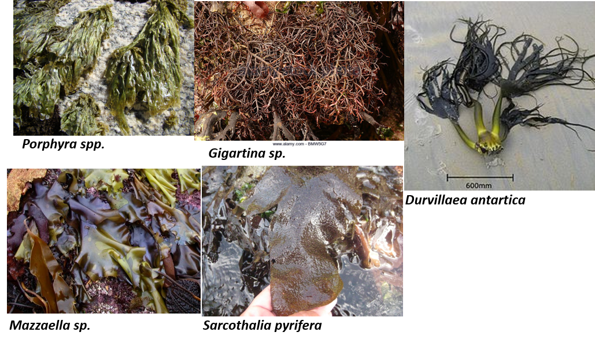
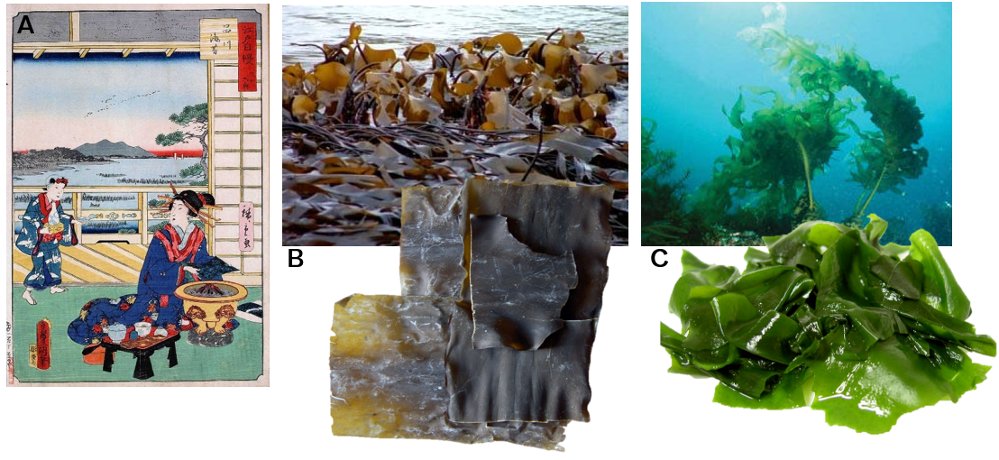

# Histoire de l’utilisation des algues {#histoire}

## La Préhistoire
Les premières traces de l'utilisation des algues datent de la préhistoire. @dillehay2008, professeur d'anthropologie à l'Université Vanderbuilt (Tenessee, Nashville) et son équipe ont découvert à Monte Verde (Chili, *Figure \@ref(fig:monteverde)*), dans d'anciens foyers et différents lieux du site,  des restes de repas incluant une quarantaine de plantes, des ossements d'animaux, des mollusques d’eau douce ET **9 espèces d'algues** (*e.g.* *Gigartina sp.*, *Porphira sp.*, *Durvillaea antarctica*,*Mazzaella sp*, *Macrocystis pyrifera*,...) (*Figure \@ref(fig:monteverdealgue)*). Ces restes ont été très bien conservés car les sols sont acides et ont limité la prolifération bactérienne.
Ces algues sont d'excellentes sources d'iode, de fer, de zinc, de protéines, d'hormones et d'un grand panel d’éléments traces (cobalt, cuivre, bore). De plus, elles ont un effet bénéfique dans l'assimilation du calcium par les os, l'amélioration des capacités de l'organisme à lutter contre les infections.


```{r monteverde, echo=FALSE, fig.cap= "Localisation du site archéologique de Monte Verde (Chili)", fig.align='center'}

knitr::include_graphics("images/Monte_verde.jpg")

```

```{r monteverdealgue, echo=FALSE, fig.cap= "Espèces d'algues retrouvées dans les restes des foyers du site archéologique de Monte Verde (Chili)", fig.align='center'}



```

D'autres traces d'utilisation des algues ont été découvertes sur le continent eurasien et datées de la période mésolithique (-7000 ans). Il a été montré par analyse isotopique que les peuples vivants sur le littoral récoltaient les algues échouées et nourrissaient leurs bétails (moutons) [@balasse2005].

## L'Antiquité

Une trace écrite de l'utilisation des algues est décrite dans le "Classique de la médecine par les plantes" ou "Shennon bencao jing" (*Figure \@ref(fig:shennong)*) traitant des drogues végétales, animales et minérales (plus de 300 drogues sont décrites). Son origine est attribué à l'empereur Shennong qui vécu aux environs de -2800 ans. Toutefois, l'original du texte est perdu et l'histoire de sa reconstitution est un peu compliquée. L'empereur Shennong (*Figure \@ref(fig:shennong)*) est considéré comme le père des pharmaciens et des médecins.Il testa toutes les plantes pour connaitre leurs propriétés et ordonna au peuple de prendre connaissance des espèces qu’on devait préserver. Certaines versions lui prétendent le pouvoir divin de mourir et revivre plusieurs fois au hasard de ses essais, alors que d’autres supposent que son action finit par lui coûter la vie en accentuant ainsi son esprit de sacrifice.

```{r shennong, echo=FALSE,fig.show='hold', fig.cap= "Shennong goûtant une herbe médicinale ; les protubérances sur son crâne rappellent qu’on lui prêtait une tête de bovidé, la collerette de feuilles son rôle d’herboriste (www.art.com)", fig.align='center',out.width='40%'}

knitr::include_graphics(c("images/shennong.jpg","images/bencaojing.jpg"))
```

Toujours en Asie, des écrits datant du VI^ème^ avt.J.-C. montre que les algues furent des aliments réservés pour les hauts dignitaires (rois et invités distingués).
> Sze Teu écrit :"Certaines algues sont un délice pour les hôtes les plus honorés, et pour le Roi lui-même."

Au VII^ème^ apr. J.-C. au moins une douzaine d'algues était cultivée dont les trois plus communes la *Nori* (pour faire des sushis), le *Kombu* (dans les soupes), le *Wakame* (dans les soupes et les salades)(*Figure \@ref(fig:japonalgues)*).

```{r japonalgues, echo=FALSE, fig.cap= "A. Préparation des feuilles de Nori pour les sushis; B. Feuilles de Kombu; C. Feuilles de Wakame ", fig.align='center'}



```

Au V^ème^ siècle, Palladius auteur latin écrivit dans son traité sur l'agriculture[^2.1] que les algues produisent une fumure de qualité très favorable à l'amendement des sols agricoles.

## Moyen-âge

Au Moyen-Âge, les algues représentent un usage traditionnel pour les populations côtières et insulaires. Elles sont utilisées dans l'agriculture comme alimentation pour le bétail et l'enrichissement des sols, dans l'usage domestique comme combustible pour le chauffage et l'alimentation humaine direct en temps de famine.

## XVII^ème^ siècle : Début de l'industrialisation des algues
### L'industrie du verre (17-18^ème^ siècle)

L'industrialisation des algues commence en Normandie par l'industrie du verre. En effet, les verriers utilisaient les cendres des algues récoltées sur l'estran pour abaisser le point de fusion de la silice facilitant la production de verre. Les algues étaient d'autant plus utilisées que le coût du bois était très élevé.Le fort intérêt économique des algues obligea Jean-Baptiste Colbert, ministre des finances de Louis XIV, de réglementer la récolte des algues : **Edit de Colbert (1681)**.

**Titre X de l'ordonnance: Concernant la récolte des algues**

* *Article I* - Les habitants des paroisses côtières se réuniront le premier dimanche du mois de janvier de chaque année, suivant la messe de la paroisse, afin de *déterminer les dates d'ouverture et de clôture de la récolte annuelle des algues trouvées dans la mer attenante à leur territoire.*

* *Article II* - L'assemblée sera convoquée par les gardes de l'église ou les trésoriers de la paroisse, et la décision de l'assemblée sera affichée à la porte principale de l'église. Ne pas le faire entraînera une amende de 10 livres.

* *Article III* - Il est, *interdit aux habitants de couper les algues pendant la nuit et à des moments autres que ceux déterminés par la communauté, de couper les algues ailleurs que sur la longueur de la côte de leur paroisse ou de le transporter vers d'autres territoires.* L'échec entraînant une amende de 50 livres et la confiscation de leurs chevaux et harnais.

* *Article IV* - Il est interdit à tous les seigneurs des propriétés côtières de s'approprier toute portion des rochers où poussent les algues, pour empêcher leurs vassaux de la recueillir pendant la saison d'ouverture, d'exiger quoi que ce soit d'eux en échange du droit de le recueillir , Ou pour permettre aux non-résidents de la paroisse de participer, l'échec entraînant une punition pour détournement.

* *Article V* - *Le droit de rassembler toutes les algues jetées sur la côte par les marées, et de les transporter là où elles le veulent, est accordé à tous.*


L'extraction de la soude commençait par le ramassage des algues échouées sur l'estran et par le séchage des algues en tas en haut de l'estran. Le tas d'algues devait être suffisamment compacte pour empêcher l'eau de pénétrer mais pas trop pour laisser l'air circuler pour le séchage. Une fois les algues suffisamment sèchent, une fosse de cinq à six pieds de long et de deux pieds de large est creusée (*Figure \@ref(fig:soude)*). Au fond de la fosse sont posés des branchage pour le feu et les algues sont posés successivement pour éviter une combustion trop rapide. La soude coule au fond de la fosse. Le feu éteint la soude refroidit en 2-3 jours formant des blocs très durs. [Plus d'informations](http://patrimoinedesabers.fr/de/landeda/histoires/214-historique-des-fours-a-goemon.html)

```{r soude, echo=FALSE, fig.cap= 'A. Tas de goémon sec devant alimenter un four à soude; B. Fours à Goémon le long du littoral breton utilisés pour le brûlage des algues; C. Pains de soude', fig.align='center'}

knitr::include_graphics("images/extract_soude.png")

```

L'industrie du verre pris énormément d'importance sous Louis XIV pour lutter contre l’hégémonie de l'industrie du verre vénitienne favorisant le prestige du roi et renforçant l'économie du pays.
La Manufacture Royale des Glaces et des Miroirs (*Figure \@ref(fig:manufacture)*) fut créée à Paris pour fournir des glaces à la Galerie des glaces. Des verriers vénitiens furent attirés en France contre argent et femmes, mais ils ne partageaient pas leurs savoirs et préféraient profiter de la distraction parisienne. Ainsi en 1667, la fabrication fut transférée à *La Glacerie* (Cherbourg). L’intégralité des miroirs de la galerie des Glaces (château de Versailles) a été fabriquée à La Glacerie entre 1683 et 1684 (*Figure \@ref(fig:versailles)*).
À la fin du règne de Louis XIV, l'industrie miroitière avec à sa tête, la Manufacture royale de glaces de miroirs, exporte des glaces dans toute l'Europe pour un équivalent de 300 000 à 400 000 livres or par an. Le monopole vénitien est remplacé par le monopole français.

```{r manufacture, echo=FALSE, fig.cap= "Devanture de la Manufacture Royale des Glaces et des Miroirs", fig.align='center'}

knitr::include_graphics("images/manufacture_royale.jpg")

```

```{r versailles, echo=FALSE, fig.cap= "Galerie des glaces du château de Versailles", fig.align='center'}


```


### La production d'iode (19^ème^ siècle)

La découverte de l'iode en 1811 est attribuée à Bernard Courtois (1777-1838) salpêtrier et chimiste français[^2.2]  vers la fin du 19^ème^ siècle [@guitard1922]. Bernard Courtois travaillait dans une salpêtrière, *i.e.* lieu où l'on produit du salpêtre (nitrate de potassium) composant essentiel de la poudre à canon. La production de salpêtre devenant très chère en raison du coût du bois qui s'éleva sous la pression des industries consommatrice de bois et sous l'effet d'un blocus continental interdisant l'importation, Bernard Courtois eut l'idée d'utiliser les cendres d'algues pour permettre la transformation du nitrate de calcium et nitrate de potassium.
La production de salpêtre entraîne la production d'un revêtement visqueux qui doit être nettoyé à l'acide. Un jour Bernard Courtois utilisa une solution d'acide plus concentrée et voit ses cuves se remplir de fumées violettes qui se cristallisent au contact des parois froides. Il réalise quelques études mais n'approfondira pas, il découvrit néanmoins que l'iode avec un fort pouvoir corrosif. Ce fut Louis-Joseph Gay-Lussac qui donna son nom à l'iode (du grec iodes qui veut dire violet).
François Benoît Tissier, élève de Nicolas Clément (confrère chimiste de Bernard Courtois), développe un procédé industriel de fabrication de l'iode et l'adapte à la production de soude raffinée de l'usine Coudurier à Cherbourg (*Figure \@ref(fig:tissier)*). Il arrive à obtenir une production annuelle de 400kg en 1825. Apprenant qu'en Bretagne les algues étaient plus abondantes, il entre chez "Guilhem" grande fabrique de soude dans le Finistère et augmente la production d'iode.
La production de l'iode à base d'algue prendra fin vers la fin du XX^ème^ siècle avec l'essor de la chimie de synthèse.


> 5-6 tonnes d'algues fraiches $\Rightarrow$ 1 tonnes d'algues séchées $\Rightarrow$ 200 kg de soude $\Rightarrow$ 3kg d'iode

```{r tissier, echo=FALSE, fig.cap= "L'usine Tissier vers 1910", fig.align='center'}

knitr::include_graphics("images/tissier.jpg")

```


En parallèle de la production industrielle, on découvre des propriétés thérapeutiques de l'iode. Le pouvoir corrosif de l'iode fait que c'est un puissant antiseptique (seul désinfectant connu à l'époque). C'est également un oligo-élément indispensable dans l'alimentation humaine car il assure le bon fonctionnement de la glande thyroïdienne siège de la régulation hormonale.

Encore actuellement, la carence en iode est un problème de santé mondiale, plus d'une 1/4 de la population mondiale souffre de carence en iode en principalement en Asie, Afrique, Amérique de sud,... (*Figure \@ref(fig:iode)*). Cela peut s'exprimer par l'apparition d'un goitre chez certaines populations (goitre endémique des population des hauts plateaux de la Tanzanie), arriération mentale, altérations de la reproduction, désordres mentaux et psychiques.


```{r iode, echo=FALSE, fig.cap= "Localisation des zones où les habitants sont carencés en iode", fig.align='center'}

knitr::include_graphics("images/iode.jpg")

```

### La production d'hydrocolloïdes (fin du 19^ème^ siècle)

> **Hydrocolloïdes** : matière constituée de nano et microparticules (2 - 200 nm) dispersées dans un liquide ou un gel  formant une solution plus ou moins épaisse.Les principaux colloïdes extraits des algues sont des polysaccharides.

Dans les années 1800, des extraits de *Chondrus crispus* (Irish moss) contenant des carraghénanes sont utilisés comme agent épaississant. Dans les années 1930, c'est au tour des alginates extraits des algues brunes d'être vendu comme gélifiant et épaississant. Cette filière permis aux goémoniers de continuer leur activité de récolte à la fin des industries du verre et de l'iode. Après la 2^nde^ guerre mondiale, il y a eu un essor rapide de l'utilisation des extraits d'algues dans l'agroalimentaire et la pharmaceutique. Cette essor fut si rapide que la production fut limitée par la disponibilité des ressources naturelles. Ainsi, dès les années 70, de nombreuses industries et instituons de recherches se sont intéressées aux cycles de vie des algues pour pouvoir maîtriser la culture et approvisionner en continue la production d'hydrocolloïde.

## De nos jours

La plus grande consommation d'algue se concentre entre la Chine, le Japon et la Corée. En moyenne, un asiatique mange 5kg d'algue/an. Comme nous l'avons vu précédemment la consommation d'algue en Asie à débuter très tôt, c'est devenue une tradition. Des chercheurs de l'Université de Pierre et Marie Curie et de la station biologique de Roscoff ont montré qu'au fil du temps, les japonais ont acquis la capacité de dégrader la porphyrane (sucre de la paroi des algues rouges) par transfert de gène entre des bactéries marines vers des certaines bactéries peuplant les intestins des Japonais [@hehemann2010].
Toutefois en Europe la consommation est indirect, on retrouve des extraits d'algues dans les aliments, les boissons, le textiles,... . 
Nous aborderons cet aspect dans le cours sur la biochimie des algues.

```{r algueatoutfaire, echo=FALSE, fig.cap= "Les algues se retrouvent cachées dans notre alimentation", fig.align='center'}

knitr::include_graphics("images/alguetoutfaire.jpg")

```


[^2.1]: Son traité est rassemblé avec d'autres traités portant sur l'agriculture et la vie rurale dans le *De re rustica*
[^2.2]: <https://plozevet.hypotheses.org/2905>


