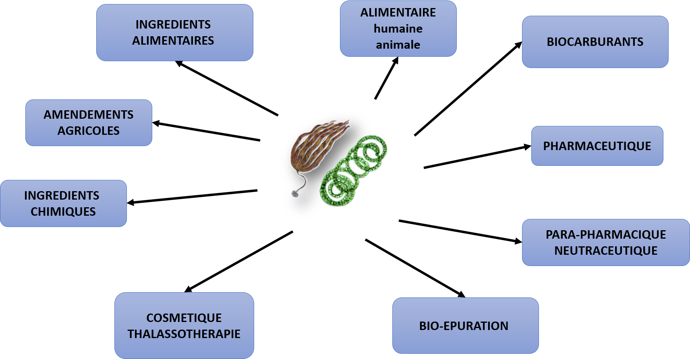
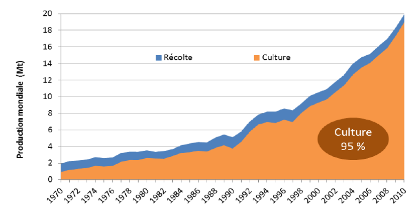

# Usages, économie et règlementation {#usage}

> Avant de lire — Ce chapitre présente les usages et marchés. Il peut être lu directement après l’histoire. Pour approfondir les bases scientifiques, référez-vous ensuite à phylogénie/évolution, classification et morphologie.

## Intérêts et Usages

A l'échelle mondiale, les algues sont principalement destinées à l'alimentation humaine (85%), 14% sont utilisées pour extraire des hydrocolloïdes (alginates, agar agar et carraghénanes). 1% de la production mondiale alimente l'industrie pharmaceutique, la cosmétique,la bioépuration et l'agriculture en amendement (*Figure \@ref(fig:application)*).

```{r application, echo=FALSE, fig.cap= "Domaines d'application des micro et macroalgues à l'échelle mondiale.", fig.align='center'}

```


### L'alimentation humaine

En France, c'est le Conseil Supérieur Hygiène Publique qui autorise la commercialisation d'aliment. L'algue n'étant pas un aliment traditionnel, pour être consommée elle doit bénéficier d'une autorisation. Les algues comestibles doivent avoir des teneurs d'iode, de métaux lourds inférieurs aux normes définies par l'Agence Française de Sécurité Sanitaire des Aliments.

Voici les normes définies par l'AFSSA (2007) :

Table: Teneurs maximales en métaux lourds et en iode pour l'autorisation de consommation (Saisine AFSSA n° 2007-SA-0007)

|               |Concentration en <br> mg.kg^-1^ d'algues sèches |
|----------|-----|
|Arsenic minéral| 3 |
|Cadmium        |0.5|
|Mercure        |0.1|
|Plomb          |5  |
|Etain          |5  |
|Iode           |2000|


A l'heure actuelle en France, 24 algues dont 3 microalgues sont utilisées comme légumes ou condiments.

Table: Algues autorisées pour l'alimentation humaine par le CSHP

|Nom scientifique| Nom vernaculaire|
|---------------|-----------|
|**Algues brunes (8)** ||
| - *Ascophyllum nodosum* | Ascophylle|
| - *Fucus serratus + vesiculosus* | Fucus|
| - *Himanthalia elongata* | Spaghetti de mer|
| - *Undaria pinnatifida* | Wakamé|
| - *Laminaria digitata + japonica* | Kombu|
| - *Saccharina latissima*| Kombu royal|
| - *Alaria esculenta* | Wakamé d'Atlantique|
||
|**Algues rouges (11)**||
| - *Palmaria palmata* | Dulse|
| - *Porphyra umbilicalis* | Nori|
| - *Porphyra tenera* | Nori|
| - *Porphyra yezoensis* |Nori|
| - *Porphyra dioica* | Nori|
| - *Porphyra purpurea* |Nori|
| - *Porphyra laciniata*|Nori|
| - *Porphyra leucostica*|Nori|
| - *Chondrus crispus*|Pioca|
| - *Gracilaria verrucosa*|Ogo-nori|
| - *Phymatolithon calcareum*| Maërl|
||
|**Algues vertes (2)**||
| - *Ulva sp.* | Laitue de mer|
| - *Enteromorpha sp.* | Aonori|
||
|**Microalgues (3)**||
| - *Arthrospina sp.*| Spiruline|
| - *Odontella aurita*| |
| - *Chlorella sp.*|Chlorelle|

### Agriculture

Les algues peuvent être utilisées comme engrais et amendement des sols. Pour maintenir une production des sols, il est indispensable de contrôler l'acidité. La concentration des ions aluminium dans la solution du sol croit fortement avec la
baisse du pH et ceux-ci deviennent toxiques à partir d’un certain seuil de pH eau, toujours inférieur à 5,5 mais très variable selon la nature du sol et l’espèce cultivée. Ces composés provoquent une forte réduction de la croissance des racines qui s’épaississent, brunissent et se ramifient peu. Elles ne sont plus alors capables d’assurer convenablement l’alimentation minérale et hydrique des plantes. Le *Maërl* est une algue calcaire qui était fréquemment utilisée pour chauler les sols et ainsi augmenter le pH des sols (*Figure \@ref(fig:maerl)*). Néanmoins, les bancs de maërl constituent des habitats remarquables Natura 2000 accueillant une richesse importante de crustacés, d'annélides et de mollusques. A l'heure actuelle, l'exploitation des gisements de maërl a fortement impacté ces habitats et par conséquent l'extraction est interdite pour mettre à la ressource de se renouveler.

```{r maerl, echo=FALSE, fig.cap= "Maërl dans son habitat naturel formant des bancs. Seule la surface du banc est composée d'algues vivantes.", fig.align='center'}
knitr::include_graphics("images/maerl.png")
```

Certaines substances extraites des algues peuvent servir d'éliciteurs, *i.e.* des substances qui déclenchent alors chez la plante toute une série de réactions cellulaires, avec notamment la production de molécules destinées à renforcer la résistance des parois, mais aussi d'antibiotiques végétaux tels que des phytoalexines ou des protéines de défense.
La laminarine qui est un polysaccharide de réserve dans les algues brunes a une structure qui se rapproche d’éliciteurs glucaniques fongiques. Son utilisation est certifié sur le blé contre l’oïdium, le piétin-verse et la septoriose.[^3.1]


### Zootechnologie

Des études *in vitro* et *in vivo* ont montré que les polysaccharides sulfatés (PS)  des macroalgues présentent un large panel d'activités biologiques (anticoagulante, antimicrobienne, antitumorale, immunomodulatrice,... .).
Olmix Group, par exemple, a extrait des (PS) à partir de l'algue verte *Ulva armoricana* et a montré que ces extraits stimulaient la production de médiateurs de l'immunité intestinale par l'activation du récepteur cellulaire intestinal TLR4 et ferait intervenir la voie de signalisation PI3K/Akt ainsi que le facteur de transcription NF-$\kappa$B.[@berri2016, @berri2017]


### Bio-carburant et Bio-plastique

Les biocarburants sont fabriqués à partir de microalgues, certaines espèces peuvent être cultivées en mode hétérotrophe à l'abri de la lumière et avec une alimentation en sucres. Cultivées dans certaines conditions (*e.g.* carence en azote) elles peuvent se mettre à produire et accumuler des lipides, principalement des triglycérides, dont la teneur peut atteindre jusqu'à 80 % de la matière sèche.
Les algues sont récoltées régulièrement et l'huile est extraite selon différents méthodes (centrifugation, traitement au solvant, lyse thermique, etc.). Ensuite deux types de conversion de l'huile en biocarburant sont mis en oeuvre (*Figure \@ref(fig:biocarburant)*):

  * *La transestérification* , qui fait réagir l'huile algale avec du méthanol ou de l'éthanol, produit un ester d'huile algale ou biodiesel, tout à fait comparable à celui obtenu à partir des autres types d'huiles végétales. Il peut être mélangé au gazole en proportion limitée à une 10^aine^% de volume.
  * *L'hydrogénation catalytique* qui fait réagir l'huile en présence d'hydrogène, suivie d'un hydrocraquage, produit des hydrocarbures qui peuvent être incorporés en quantité importante au gazole ou au kérosène.

La production de carburant à partir de microalgues reste toutefois coûteuse, *le prix actuel est de 5€/L*.

```{r biocarburant, echo=FALSE, fig.cap= "Processus de production de biocarburant à partir de microalgues", fig.align='center'}
knitr::include_graphics("images/biocarburant.jpg")
```


Depuis quelques années, les bioplastiques se démocratisent de plus en plus car ils sont biodégradables. Un ingénieur a réussi à faire de même avec des algues (exclusivement des algues brunes) en créant "algopack" : « La matière se dégrade en 12 semaines en terre. Cela permet de retrouver l’une des fonctions historiques de l’algue : c’est un fertilisant naturel » (*Figure \@ref(fig:algopack)*).
La tonne de granulés d’Algopack est vendue 1 200 €, lorsqu’une tonne de PVC ou PET est vendue 1 000 € et une tonne de polyéthylène ou polypropylène environ 1 300 €. Les algues utilisées pour fabriquer ces produits sont des algues brunes.

```{r algopack, echo=FALSE, fig.cap= "Bioplastiques produits à partir d'algues brunes", fig.align='center'}

```


### Cosmétique et santé humaine

Beaucoup de métabolites secondaires issus des algues sont connus pour être bénéfique pour la peau (protection anti-UV, anti-rides, rafermissant,....). L'effet 'anti-âge' est du à la présence de composés anti-oxydants (caroténoïdes). Le nombre de produits comestiques utilisant des extraits d'algues augementent de jours en jours car ils utilisent des produits naturels et non issu de la pétro-chimie [@ariede2017] (*Figure \@ref(fig:cosmetique)*)


```{r cosmetique, echo=FALSE, fig.cap= "Exemples d'application des algues [@ariede2017]", fig.align='center'}

```


## L'économie de l'algue
###  Le marché mondial

Comme nous l'avons vu précédemment, l'industrie de la transformation des algues a débuté après la seconde guerre mondiales et s'est fortement accentuée dans les années 70. A cette époque, le tonnage d'algues récoltées et cultivées était très proche (*Figure \@ref(fig:marchemondial)*). En 40 ans, la production d'algues a augmenté en moyenne de 29% par an, on remarque une nette augmentation de la production à partir de 1990. Aujourd’hui, la production d'algues s'élève à plus de 23 millions de tonnes dont 95% proviennent des fermes d'algocultures. Cette exploitation d'algue concerne environ 35 pays de l'hémisphère nord et sud, de zone tempérée ou tropicale : Chine, Japon, France, Norvège, Brésil, Chili,... .

```{r marchemondial, echo=FALSE, fig.cap= "Evolution de la production mondiale d’algues entre 1970 et 2010", fig.align='center'}

```


La production mondiale est dominée par les pays asiatiques : Chine (52%), Indonésie (26%), Philippines (7%), Corée (7%) et Japon (3%). Dans ces pays, les algues sont principalement cultivés à des fins d'alimentation humaine. L'Europe quant à elle participe à seulement 1% de la production mondiale soit 250 000t. 57% de la production européenne provient de la Norvège, 14% de France, 12% d'Irlande et 7% d'Islande.


### Le marché français

La France se situe au 10^ème^ rang mondial et est le 2^ème^ producteur européen. Son schéma de production est au antipode du schéma mondial. En effet, 99% de la production d'algues provient de la récolte et non de la culture. 75% de la production française est extraite par des goémoniers, navires spécialisés dans la récolte des laminaires (12 tonnes /jour) et 25% est extraite manuellement (algues de rive).

```{r recoltealguemain, echo=FALSE, fig.cap= "Récolte manuel des algues de rive sous à une licence d'exploitation", fig.align='center'}
knitr::include_graphics("images/recoltealguemain.png")
```

```{r goemonier, echo=FALSE, fig.cap= "Goëmonier récoltant les laminaires", fig.align='center'}

```


L'économie est également opposée à l'économie mondiale de l'algue, 99% des produits à base d'algues sont à destination de l'agro-industrie (agroalimentaire et agro-fourniture), seulement 1% est orienté vers l'alimentation humaine directe. En effet 75% des algues récoltées sont des laminaires, algues riches en alginate (hydrocolloïde). Ces alginates sont très utilisés dans l'agroalimentaire comme agent épaississant.
Ainsi les activités économiques liées aux macroalgues sont localisées principalement en Bretagne. La matière première est principalement orientée vers "la santé et le bien être" (45 entreprises), puis vers l'agrofourniture et l'alimentation (resp. 25 entreprises). Seule une dizaine d'entreprises transforment les macroalgues pour l'agroalimentaire, la chimie et la microbiologie (*Figure \@ref(fig:algueatlantique)*).


```{r algueatlantique, echo=FALSE, fig.cap= "Localisation des activités économiques liées aux algues (Programme NetAlgae)", fig.align='center'}

```


L’engouement pour les algues tant alimentaires que non alimentaires se traduit par la multiplication du nombre de projets et initiatives visant à développer et a structurer la filière:

* NetAlgae
* Normand'Algue
* CEVA
* Idealg
* AlgMarBio

## Règlementation de pêche et de récolte des végétaux marins

En France, la récolte des algues est réglementée par le décret ministériel du 11 août 1990 (N°90/719)[^5.1] et complétée par des arrêtés préfectoraux pour les spécificités régionales. Il définit :

 * les espèces d'algues autorisée à la récolté
 * les conditions de récoltes (engins, saisons, zones)
 * les quantités (quotas/espèce/zone)
 * les santions pour tous manquements à ce règlement (amende de 5^ème^ classe)

Ce texte de lois regroupe sous le terme **Goémons** tous les végétaux marins, algues, varech et plantes marines.

### Le goémon de rive

> **"Algues fixées sur l’estran, récoltées à pied sur le rivage ou sur îlots inhabités"** 

Il est interdit de récolter ces algues sur des ouvrages maritimes (quais, berges, canaux) pour des raisons de sécurité pour les récoltants mais également pour des raisons sanitaires. Il est interdit de d'arracher le goémon, la récolte doit être réalisée au moyen d'une faucille pour permettre à la ressource de se renouveler. Il est également obligatoire de déclarer les algues récoltées pour suivre les stocks naturelles et éviter une sur-exploitation.
La récolte du goémon de rive est autorisée tout au long de l'année à l'exception du *Chondrus crispus* dont la période de récolte se déroule du 1^er^ mai au 30 octobre.

* algues rouges : *Chondrus crispus , Gracilaria gracilis, Palmaria palmata, Porphyra sp*

* algues brunes : *Ascophyllum nodosum , Fucus serratus, Fucus vesiculosus,Himanthalia elongata*

* algues vertes : *Ulva sp, Ulva (Enteromorpha) sp*

Le guide "Récolte des algues de rive : Guide des bonnes pratiques"[^5.2] (*Figure \@ref(fig:alguepratique)*),rédigé par le Parc Naturel Marin d'Iroise en collaboration avec le CEVA,..., est à destination des particuliers et des professionnels pour expliquer les bonnes pratiques de récoltes des algues pour préserver les ressources. Il contient les règles de bonnes pratiques et des fiches pour chaque espèce autorisée à la récolte.


```{r alguepratique, echo=FALSE, fig.cap= "Exemples de mauvaises et bonnes pratiques pour la récolte du goémon de rive", fig.align='center'}

```


### Le goémon de fond

> **"Algues poussant en zone toujours immergée (algues de fond), non accessible à pied  aux basses mers des marées d’équinoxes"** 

La récolte du goémon de fond implique d'utiliser des navires et des embarcations spécialisées qui sont déclarés au registre maritime (*Figure \@ref(fig:goemonierrecolte)*). Les personnes qui pratiquent la pêche des goémons poussant en mer en action de nage ou de plongée par quelque procédé que ce soit ne peuvent le faire qu'à partir d'un navire ou d'une embarcation titulaire d'un rôle d'équipage de pêche.La récolte est autorisée du 15 avril au 31 décembre pour ne pas impacter la période d'émission des spores et des gamètes. Les zones de récoltes sont définies par les affaires maritimes (Direction des ressources marines) après concertations avec les comités des pêches et les instances scientifiques en charge de l'étude des stocks (IFREMER, MNHN, ...). Les instruments employés pour la récolte des goémons doivent être conçus et utilisés de manière à éviter
l'arrachage des crampons ou bases de fixation.

```{r goemonierrecolte, echo=FALSE, fig.cap= "Récolte de *Laminaria hyperborea* par des goémoniers utilisant le peigne norvégien.", fig.align='center'}

```


### Le goémon épave

> **"Algues détachées par la mer, dérivant au grès des flots ou échouées sur le rivage."** 

Le ramassage de ce type de goémon n'est pas assujetti à des restrictions pour les particuliers mais les professionnels doivent faire une demande d'autorisation auprès des affaires maritimes. Le ramassage est autorisé toute l'année au moyen de tout type d'engin : râteaux, pelles, pelleteuses,... (*Figure \@ref(fig:goemonepave)*).

```{r goemonepave, echo=FALSE, fig.cap= "Récolte du goémon épave : exemple de rammassage des ulves (marée verte)", fig.align='center'}

```


[^3.1]: <http://www.goemar.com/fr/historique-activites>

[^5.1]: [Décret n°90-719 du 9 août 1990 abrogé le 1 janvier 2015](https://www.lejpgrance.gouv.fr/affichTexte.do?cidTexte=LEGITEXT000006076323)

[^5.2]: [Lien guide de récolte des algues de rive](http://www.parc-marin-iroise.fr/Documentation/Guide-des-bonnes-pratiques-des-recoltants-d-algues-de-rive/Guide-de-bonnes-pratiques-recolte-des-algues-de-rive)
