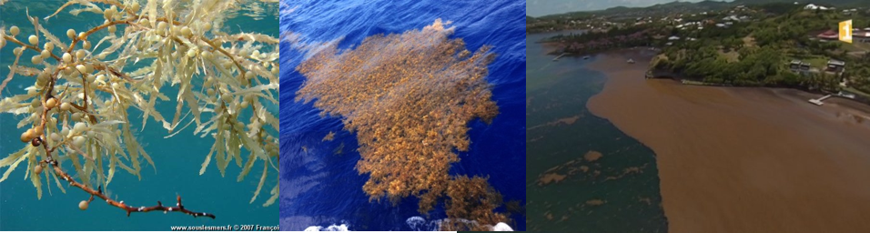
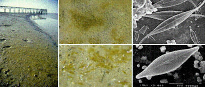
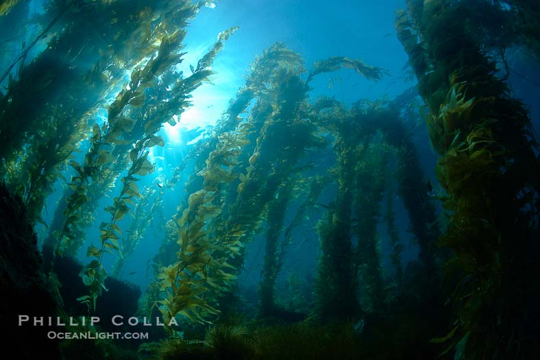

# Classification et Diversité des algues {#classification}

> Avant de lire — Avoir en tête la phylogénie/évolution facilite ce chapitre. Ensuite, enchaînez avec « Morphologie », « Cytologie » et « Biochimie ».

##  Quelques définitions

Avant de rentrer dans le cœur de la classification et de savoir ce qu'est réellement une algue, il est important de mettre une définition sur des termes que certains d'entre-vous ont du entendre en cours de SVT.

**La systématique** : science de la classification des êtres vivants basée sur des données biologique, biochimique, moléculaire, génétique, écologique,... . Elle regroupe la taxinomie, la nomenclature, la classification.

**La taxinomie** : (grec taxis « placement », « classement », « ordre » et de nomos qui signifie « loi », « règle »). Elle a pour objet de *décrire les organismes vivants et de les regrouper* en entités appelées *taxons* afin de les identifier puis les nommer et enfin les classer et de les reconnaître via des clés de détermination dichotomiques. Le terme fut créé en 1813, sous la graphie de taxonomie, par le botaniste suisse Augustin Pyrame de Candolle (1778-1841) dans sa Théorie élémentaire de la botanique ou exposition des principes de la classification naturelle et de l'art de décrire et d'étudier les végétaux [@de1844].

**La nomenclature** : est une discipline qui a pour objectif de définir et d'élaborer des règles permettant de former les noms de taxons des organismes. Ces règles sont revues tous les six ans et sont regroupées dans l'[*International Code of Botanical Nomenclature*](http://iapt-taxon.org/nomen/main.php) (ICBN).

Voici la nomenclature utilisée en systématique végétale:

Table: Règles de nomenclature en botanique d'après l'*International Code of Botanical Nomenclature* (2012).

| Rang taxinomique | Terminaison               | Exemple           |
|------------------|---------------------------|-------------------|
| Règne            | --ae/a                    | Plantae           |
| Embranchement    | --phyta                   | Rhodophyta        |
| Classe           | --phyceae                 | Florideophyceae   |
| Ordre            | --ales                    | Palmariales       |
| Famille          | --aceae                   | Palmariaceae      |
| Genre            | -- us, um, is, a, ium,... | Palmaria          |
| Espèce           |                           | *Palmaria palmata*|


Plusieurs critères vont être pris en compte pour décrire les organismes et ainsi les identifier :

* Morphologiques
* Cytologiques
* Biochimiques
* Génétiques et/ou moléculaires


La classification classique établit des taxons en fonction de critères de ressemblance, avec l'essor des outils génétiques et moléculaires, il est maintenant possible de regrouper les taxons en fonction des liens de parenté. Ainsi, un taxon regroupe des individus proche génétiquement mais il est possible qu'il n'y ait pas de ressemblances phénotypiques car l'environnement peut être différents (e.g. le polymorphisme chez les algues).

Nous aborderons ces différents critères au fur et à mesure des différents cours magistraux et travaux pratiques.

## Qu'est-ce qu'une algue?

Comme vous l'avez appris en SVT, les algues font partis du règne **végétal**, *i.e.* ce sont des eucaryotes unicellulaires / pluricellulaires **photosynthétiques**. Les cellules végétales possèdent *une paroi pectocellulosique*, *des vacuoles* et *des organites spécifiques*. Cette classification est toutefois un peu plus complexe, en effet lorsque l'on prend en compte les données moléculaires le groupe des végétaux apparaît comme polyphylétique (*Figure \@ref(fig:arbre-phylo)*). Ainsi, en systématique les termes chlorobionte, rhodophytes, hétérokontophytes, Euglénophytes sont préférés au terme général végétal car ils correspondent à des groupes monophylétiques.


```{r arbre-phylo, echo=FALSE, fig.cap= "Arbre phylogénétique représentant les principaux groupes eucaryotes basé sur des données moléculaires et structurales, @baldauf2003 modifié.", fig.align='center'}
knitr::include_graphics("images/arbre_phylogenetique.png")
```


Comme le terme "végétal", le terme "algue" réfère à un groupe polyphylétique communément appelé **thallophyte**. Les organismes appartenant à ce groupe partagent les caractères suivants :

* **non vascularisés**
* **sans feuilles, ni racine, ni tige**
* **appareil végétatif simplifié (*thalle*)**
* **photosynthétique**
* **cryptogames (les organes reproducteurs sont dissimulées à la différence des *phanérogames*)**
* **mode de vie aquatique (besoin absolu d’eau pour réaliser leur cycle de vie)**

Le terme thallophyte inclut actuellement les champignons, les algues, les lichens et certaines bactéries (cyanobactérie).

## Diversité des thallophytes

Les thallophytes regroupent une très grande diversité d'organismes *procaryotes* (absence d'un "vrai noyau" avec une double membrane nucléaire) et d'*eucaryotes*.

### Pélagique *versus* Benthique

Les algues peuvent être pélagique, *i.e.* elles subissent le mouvement de l'eau. Le **phytoplancton** rassemble des micro-organismes autotrophes dérivant au grès des courant. Ce phytoplancton est souvent définit comme l'un des poumons de la Terre. Il existe également des macroalgues pélagiques qui se développent en pleine mer et flottent à la surface de l'eau à l'aide de flotteurs (*Figure \@ref{fig:sargasse}*). Ces algues s’accumulent dans des eaux calmes, sans courant pour formant des îles flottantes. C'est le cas des sargasses pélagiques (*Sargassum fluitans* et *Sargassum natans*) fucacées qui flottent à la surface des eaux de la Mer des Sargasses. Cette zone de l’Atlantique nord-ouest est connue pour avoir des conditions climatiques très calmes favorisant l'accumulation des sargasses.


```{r sargasse, echo=FALSE, fig.cap= "Flotteurs de *Sargassum fluitans* et formation d'îles flottantes.", fig.align='center'}

```


Les algues benthiques sont des organismes fixées sur un support au fond de l'eau. La majorité des macroalgues sont fixées sur un substrat rocheux par un système de fixation (crampon, disque, haptère). Les microalgues se déposent quant elles sur le substrat et forment un biofilm favorisant leur prolifération (*Figure \@ref{fig:biofilm}*). On trouve beaucoup de biofilms bruns (dominés par les diatomées) dans les estuaires et les vasières après une période ensoleillée.

```{r biofilm, echo=FALSE, fig.cap= "Biofilms à la surface des sédiments composés de diatomés pennées.", fig.align='center'}

```


### Microalgues *versus* Macroalgues

**Les microalgues** sont des organismes unicellulaires ou filamenteux de 0.8$\mu$m à 200$\mu$m. On connait la spiruline (*Arthrospira spp.*, *Figure \@ref{fig:microalgue}B*)vivant en eaux saumâtres très utilisées en agroalimentaire. *Ostreococcus tauri* (*Figure \ref{microalgue}A*), apparue il y a 1.5 milliard d'années, est la plus petite cellule eucaryote avec un noyau de 20 chromosomes et un génome de 12 513 Mpb. Elle est dépourvue d'une paroi cellulaire (au sens végétal), de flagelles, mais possède un chloroplaste, un appareil de Golgi et un mitochondrie. Parmi les microalgues, 8 grands groupes rassemblent plus de 80% des espèces connues :

* Diatomées
* Chlorophytes
* Rhodophytes
* Cyanobactérie
* Euglénophytes
* Cryptophytes
* Haptophytes
* Dinophycés

```{r microalgue, echo=FALSE, fig.cap= "Exemples de microalgues. A. *Ostreococcus tauri*; B. *Arthrospira platensis* (spiruline).", fig.align='center'}
knitr::include_graphics("images/microalgues.png")
```
 

**Les macroalgues** sont des organismes pluricellulaires compris entre 200 $\mu$m et 50m. *Macrocystis pyrifera* est la plus longue algues du monde, elle peut attendre jusqu'à 43 mètres de long formant des forêts sous-marines. Elle vit fixée sur le substrat rocheux grâce à de solides crampons (*Figure \@ref{macrocystis}*).

```{r macrocystis, echo=FALSE, fig.cap= "Forêt sous-marine de *Macrocystis pyrifera* (Phillip Colla, OceanLigth.com).", fig.align='center'}

```

Parmi les macroalgues, on distingue 3 groupes en fonction de leur composition pigmentaire. Ces trois groupes possèdent la chlorophylle a mais également des pigments sur-numéraires leur conférant une couleur caractéristique :


* **Rhodophytes** : Algues rouges

* **Chlorophytes** : Algues vertes

* **Phéophycées** : Algues brunes