# Diversité morphologique des algues {#morphologie}


```{r setup4, include=FALSE}
require(knitr)
opts_chunk$set(echo = FALSE, warning = FALSE, message = FALSE,fig.align = "center", fig.pos = "H")
```

## Quelques définitions{-}

**Morphologie** : science “descriptive” de la *forme externe et de la structure* des êtres vivants

Etudier la morphologie d'une algue implique de définir :

* sa structure
* le type de ramification
* le type de fixation
* les originalités du thalle

**Anatomie** : science qui s’intéresse à la *structure interne* des organismes

**Polymorphisme** : propriété qu'ont les individus d'une espèce de se présenter sous plusieurs formes différentes. Il s'agit de processus d'adaptation des individus aux conditions de milieux (*Figure  \@ref(fig:polym-condrus)*).

```{r polym-condrus,echo=F,fig.cap="Exemple de polymorphisme chez *Chondrus crispus*",out.width = "70%"}
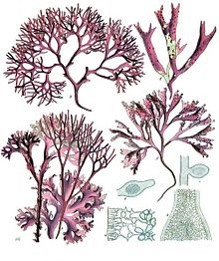
```


A l'issu de ce cours, vous serez capable de déterminer les caractéristiques morphologiques des algues ceci dans le but de leur donner un nom d'espèce.

## Structure du thalle

La structure des thalles est classée en fonction de sa compléxité (du moins au plus complexe) :

 **Archéthalle $\rightarrow$ Nématothalle $\rightarrow$ Cladomothalle** 


### Archétalles

**Thalle formé de cellules isolées (archéthalle unicellulaire) ou groupées (archéthalle pluricellulaire).**

Toutes les cellules sont identiques et ont donc le même rôle, elles sont capables de se diviser par bipartition (mitose) ou de diviser leur contenu en spores mobiles ou non (méiose). *Dans le cas des archéthalles pluricellulaire, il n'y a pas de communications intercellulaires* (*Figure \@ref(fig:archetallediv)*).


```{r archetallediv,echo=F,fig.cap="A. Multiplication végétative par mitose d'un archéthalle unicellulaire; B. Production de spores par méiose d'un archéthalle unicellulaire mobile",out.width = "70%"}
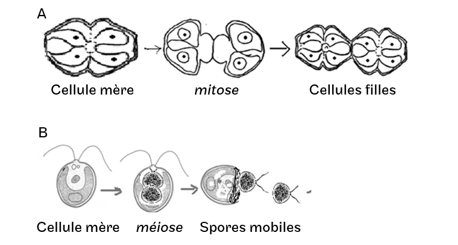
```

#### Cellules isolées


**Thalle COCCOÏDE** : Cellules isolées et **immobiles** (*Figures \@ref(fig:chlorella)-\@ref(fig:pleurosigma) *)

```{r chlorella,echo=F,fig.cap="*Chlorella sp.* (Chlorophycée)",out.width = "70%"}
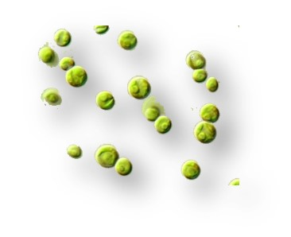
```

```{r pleurosigma,echo=F,fig.cap="*Pleurosigma sp.* (Bacillariophycée)",out.width = "40%"}
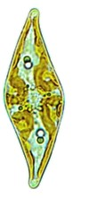
```


**Thalle MONADOÏDE** : Cellules isolées et **mobiles** nageant à l'aide d'un ou plusieurs flagelles (*Figures \@ref(fig:chlamydomonas)-\@ref(fig:euglene) *). Ces organismes sont appelés *monades* (*e.g.* *Chlamydo**monas** sp.*, *Crypto**monas** sp.*,)

```{r chlamydomonas,echo=F,fig.cap="*Chlamydo**monas** sp.* (Chlorophycée)",out.width = "70%"}
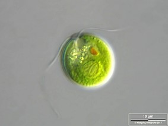
```

```{r euglene,echo=F,fig.cap="*Chlamydo**monas** sp.* (Chlorophycée)",out.width = "70%"}
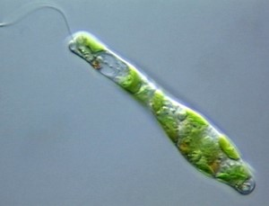
```


#### Cellules groupées

Thalles pluricellulaires **d'une même espèce**, flagellés ou non, rassemblés dans une substance constituée de polysaccharides qui gonfle au contact de l'eau (**mucilage**). Le mucilage protège la colonie des agressions extérieures et des infections.


* **Colonie SARCINOÏDE** : quelques cellules sont réunies en amas dans un mucilage (*Figure \@ref(fig:sarcino)*).


```{r sarcino,echo=F,fig.cap="*Chloro**sarcino**psis sp.* (Chlorophycée)",out.width = "70%"}
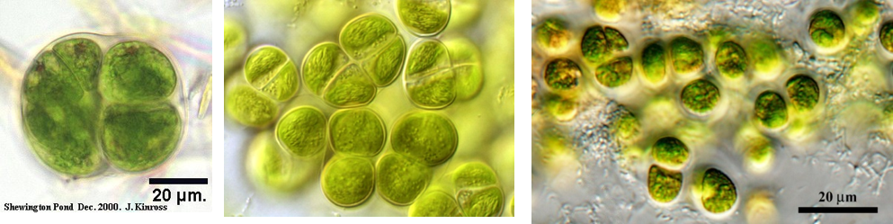
```


* **CŒNOBE** : Colonie dont le nombre de cellules est fixé génétiquement, lorsque le nombre de cellules maximal est atteint il n'y a plus de divisions possibles. La colonie est obtenue par bipartition des cellules et maintenue par un mucilage. 
    
    
    + Le genre Pandorina (chlorophycée d'eau douce)  

    Colonie constituée de 4 à 32 cellules selon les espèces, les cellules se divisent toutes en même temps un *nombre défini de fois*. La mitose peut parfois être incomplète formant des ponts entre les cellules. Chaque cellule possède *deux flagelles avec deux vacuoles contractiles à la base, un stigma et un chloroplaste pariétal avec au moins un pyrénoïde*. Toutefois, seules les cellules en périphérie gardent leurs 2 flagelles, les cellules internes perdent leurs flagelles et réalisent uniquement la photosynthèse.  
      
      
    + Le genre Volvox (chlorophycée d'eau douce)[^1.1]  
 
    Colonie de 3000 à 50000 cellules formant une sphère creuse de 5mm de diamètre (*Figure \@ref(fig:volvox)*). Les cellules en périphérie sont biflagellées et unies entre elles par des connexions cytoplasmiques. Les colonies de cellules sont séparées i) cellules végétatives ou somatiques (petites et nombreuses) en périphérie et ii) grandes cellules reproductrices légèrement en retrait des cellules somatiques, en fonction des conditions elles vont soit se diviser activement pour former des colonies filles (reproduction asexuée), soit être à l'origine de la formation de gamètes mâle et femelle (reproduction sexuée).  
    
```{r volvox,echo=F,fig.cap="*Volvox sp.* (Chlorophycée) [(Sundance Raphael, 2007)](http://commons.wikimedia.org/wiki/User:Sundance_Raphael) 1. Cellules biflagellées; 2. Colonies filles; 3. Ponts cytoplasmiques; 4. Mucilage; 5. Cellules reproductrices; 6. Cellules somatiques",out.width = "70%"}
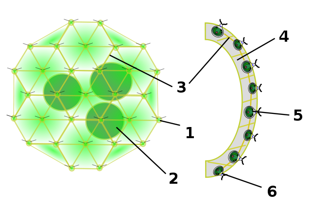
```

    
    Les genres Pandorina et Volvox montrent les débuts de la polarisation des colonies, en effet les cellules ou les colonies présentent des fonctions différentes entre les parties antérieures/postérieures, périphérie/intérieur,... .Bien que ces colonies soient des archéthalles, on remarque un début de spécialisation entre les cellules ayant un rôle dans la mobilité et/ou dans la photosynhèse et/ou dans la reproduction.

**Attention**, les colonies de cyanobactéries (*Figure \@ref(fig:merismopedia)*) ne sont pas des cœnobes car il y a une constante augmentation du nombre de cellules jusqu'à la fragmentation du thalle (multiplication végétative).  

```{r merismopedia,echo=F,fig.cap="Colonie de *Merismopedia glauca* (Cyanobactérie)",out.width = "70%"}
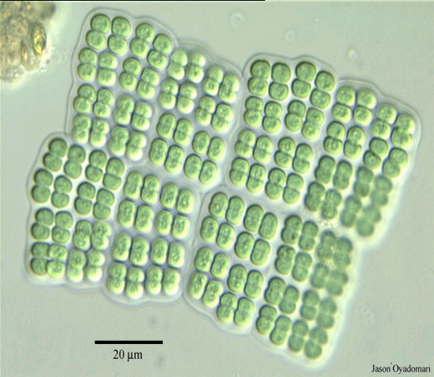
```


* **Colonie PALMELLOÏDE** : Cellules immobiles réunies dans un mucilage formant un amas. Il n'y a pas de connexions intercellulaires. 

Beaucoup d'espèces formant ce type de colonie font partie de la famille des Palmellaceae (*e.g.* *Sphaerocystis sp.*, *Palmella sp.*, *Figure \@ref(fig:palmell)A1, A2 et B*). Parfois, ce type de colonie correspond à un stade de vie lors de la perte des flagelles (*e.g.* *Chlamydomonas sp.*, *Figure \@ref(fig:palmell)C*).

```{r palmell,echo=F,fig.cap="Exemple de colonies palmelloïdes. A1. *Palmella sp.* en colonie ; A2. *Palmella sp.* en solitaire ; B. *Sphaerocystis sp.* ; C. *Chlamydomonas sp.*",out.width = "70%"}
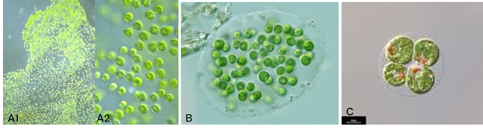
```


* **Colonie DENDROÏDE** : Cellules réunies dans un mucilage de forme arbusculaire (*Figure \@ref(fig:dendroide)*).


```{r dendroide,echo=F,fig.cap="Exemples de colonies dendroïdes. A. *Colacium  sp.* ; B. *Ophiocytium arbuscula* ; C. *Dinobryon divergens*",out.width = "70%"}
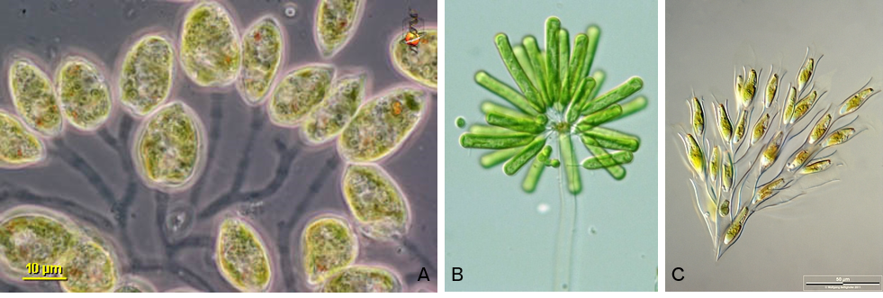
```


### Nématothalles
#### Structure

**Les nématothalles** sont des thalles avec des cellules spécialisées et une zone spécifique de croissance (apicale ou diffuse). Ces thalles sont constitués de filaments rampants ou dressés / ramifiés ou non. Les cellules peuvent communiquer entre elles via des ponts cytoplasmiques ou des synapses bouchées par un bouchon synaptique.

#### Les filaments

**Un filament** est un thalle constitué de files de cellules qui forment des axes et des ramifications ayant un diamètre fin. C'est la construction pluricellulaire la plus simple. Pour former des filaments les cellules se divisent dans un même plan et ne s'individualisent pas à l'issu de la mitose, ainsi elles partagent la lamelle moyenne et forment des ponts cytoplasmiques.  

* **Filaments unisériés (haplostiques)** : Une seule file de cellules séparées par *des cloisons transversales* (*Figure \@ref(fig:haplostique)*).


```{r haplostique,echo=F,fig.cap="Exemples filaments unisériés sans ramifications A. *Spyrogira  sp.* ; avec ramifications B. *Pylaiella sp.*",out.width = "70%"}
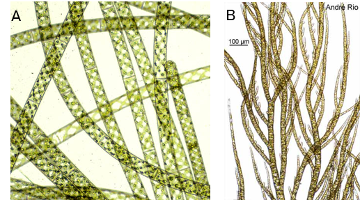
```


* **Filaments plurisériés (polystiques)** : Plusieurs files de cellules séparées par des cloisons transversales et longitudinales (*Figure \@ref(fig:polystique)*).


```{r polystique,echo=F,fig.cap="Exemples filaments plurisériés *Bangia sp.*",out.width = "70%"}
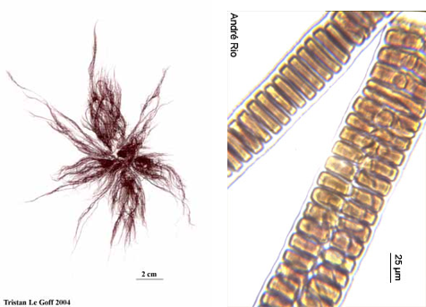
```


#### les thalles foliacés

Les cellules dans un thalle foliacé (*Figure \@ref(fig:thallefoliace)*) peuvent se diviser à la fois sur le plan latéral et longitudinal formant des thalles monostromatiques, *i.e.* avec une seule couche de cellule (*Porphyra sp.*). Chez certaines algues, la lame peut être formée de deux couches (bistromatique, *Ulva sp.*) ou plus (pluristromatique, *Dilsea carnosa*).

```{r thallefoliace,echo=F,fig.cap="Développement d'un thalle foliacé : *Ulva lactuca*",out.width = "70%"}
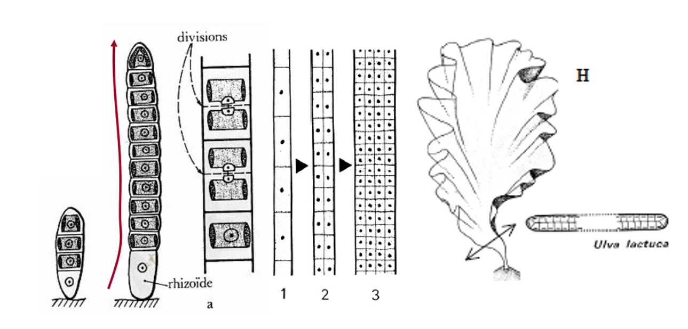
```

 

#### les thalles tubulaires

Ces thalles ont la particularité *d'être creux* entourés d'une ou plusieurs couches de cellules. Ils peuvent être tubulaire ou aplati (*Figure \@ref(fig:thalletube)*).


```{r thalletube,echo=F,fig.cap="Structure de thalles tubulaires. *Enteromorpha sp.* et *Enteromorpha linza* (FAO)",out.width = "70%"}
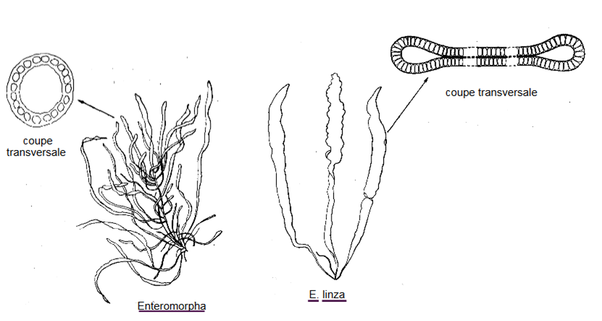
```


#### les cordons

Contrairement aux thalles tubulaires, les thalles en forme de cordon sont plein, remplis d'un parenchyme. Ce parenchyme est constitué de grandes cellules spécialisées dans le stockage des réserves.

#### les thalles encroûtants

Les thalles encroûtants sont plus ou moins fixés sur le substrat, ils peuvent être calcaire ou non.  

*Processus de calcification chez les algues calcaires*

La précipitation du carbonate de calcium ou calcite (CaCO~3~) a lieu dans les parois des cellules qui sont totalement calcifiées par ces dépôts carbonatés, à l’exception des cellules reproductives et des cellules externes de l’épithélium. Les thalles épais présentent une différenciation cellulaire; les cellules de l’épithélium possèdent des pigments photosynthétiques alors que les cellules de réserves sans pigments photosynthétiques se situe dans la zone médullaire.  

Le processus de précipitation du carbonate de calcium est chimiquement contrôlé par *l’état de saturation en carbonate de calcium de l’eau de mer nommé $\Omega$*. Lorsque $\Omega$ est **supérieur à 1, la calcification** prévaut alors que lorsque $\Omega$ est **inférieur à 1, c’est la dissolution** qui est favorisée (*Figure \@ref(fig:calcification)*).

$$Ca^{2+} + 2HCO_3^- \rightarrow Ca^{2+} + CO_3^{2-}+CO_2 \rightarrow CaCO_3+H_2O+CO_2$$

La présence de substrats organiques (polysaccharides et fibrilles) conditionne la précipitation des carbonates dans la paroi
cellulaire suivant un modèle de calcification. Ces substrats organiques se lient avec des ions calcium (Ca^2+^) pour former des sites de nucléation favorisant la calcification.  

L’utilisation du CO~2~ par la photosynthèse (induite par la diffusion du CO~2~ ou la déshydratation du HCO3^-^ en CO~2~ par une anhydrase carbonique) et l’excrétion des H^+^ par des pompes à protons déplacent l’équilibre des carbonates vers le
CO3^2-^ et favorise donc la précipitation du CaCO~3~.

```{r calcification,echo=F,fig.cap="Schéma récapitulatif des processus de calcification dans la paroi cellulaire des Corallinacées (d'après Noisette F., 2013)",out.width = "70%"}
knitr::include_graphics("./images/calcification.JPG")
```  


### Cladomothalles
#### Structure générale

Les thalles cladomiens sont les thalles les plus complexes possèdent des zones spécifiques de croissance.
(*Figure \@ref(fig:cladom1)*)

  * La cellule initiale du cladome en se divisant va former le cladome I^aire^
  * Des cellules coaxiales vont former des cladomes II^aire^
  * Certaines cellules des cladomes I^aire^ et II^aire^ vont former des pleuridies.
  

```{r cladom1,echo=F,fig.cap="Structure d'un thalle cladomien.",out.width = "70%"}
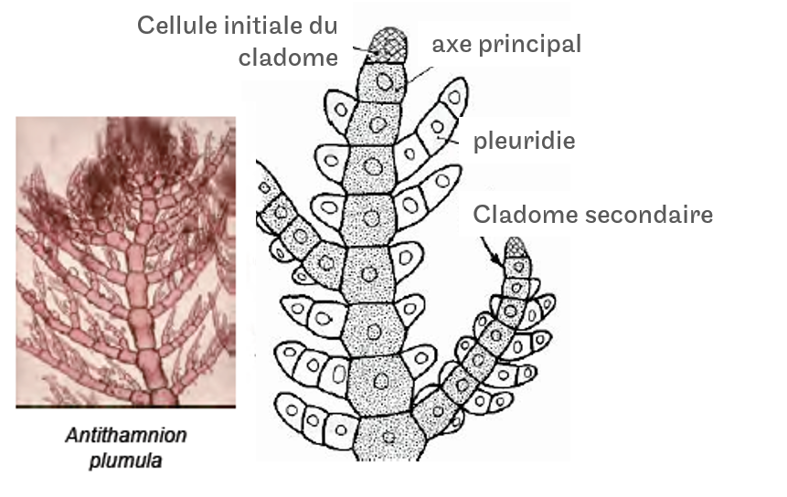
```  
  

Les thalles peuvent être uniaxiaux, il n'y a donc qu'un seul cladome I^aire^ (*Figure \@ref(fig:cladom2)A*) ou multiaxiaux, *i.e* que le thalle possèdent plusieurs cladomes I^aire^ (*Figure \@ref(fig:cladom2)B*). Les pleuridies peuvent également fusionnées pour former des thalles foliacées, on parle alors de pseudo-nervures *Figure \@ref(fig:cladom3)*).

```{r cladom2,echo=F,fig.cap="Structure des thalles cladomiens. A. Cladome uniaxial d'*Antithamnion sp.*; B. Cladome multiaxial de *Codium sp.*",out.width = "70%"}
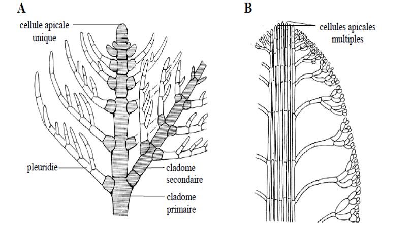
```  

```{r cladom3,echo=F,fig.cap="Exemple d'un thalle cladomien avec fusion des pleuridies",out.width = "70%"}
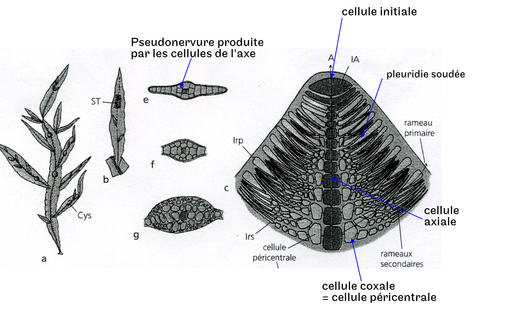
``` 


#### Formation d'un thalle cladomien


### Thalles fucoïdes

Les thalles fucoïdes sont propres aux algues brunes (*Figure \@ref(fig:thallefucoide)*). Ces thalles sont divisés en trois parties :  

* **La lame** (ou la fronde) est la partie la plus longue de l'algue est peu avoir des morphologies très variées (digitée, monolame, gaufrée, avec sous sans pseudo-nervure.)

* **Le stipe** cylindrique ou aplati peut être : 
    + *rigide* permettant le maintien du port aérien de l'algue
    + *souple* conférant à l'algue une résistance aux forces hydrodynamiques
    
* **Le crampon** : permettant à l'algue de s'ancrer sur le substrat plus ou moins irrégulier.


```{r thallefucoide,echo=F,fig.cap="Exemple d'un thalle cladomien avec fusion des pleuridies",out.width = "70%"}
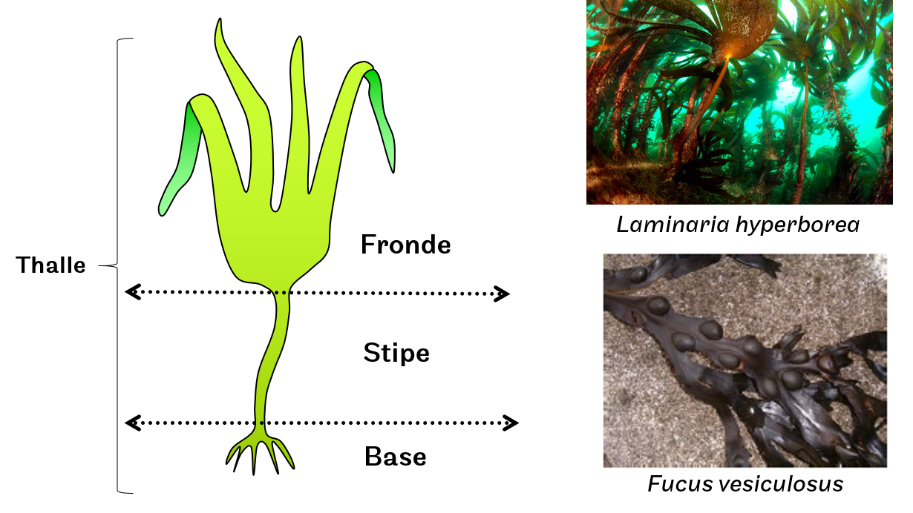
``` 


## Les différentes ramifications

Le type de ramification est un critère de morphologie important pour déterminer le nom d'une algue.  

* **Dichotome** : La dichotomie est issue de la division latérale régulière de la cellule initiale du cladome (*Figure \@ref(fig:dicho)A*)

* **Pseudo-dichotomie** : La cellule initiale du cladome ne se divise pas régulièrement sur le plan latéral (*Figure \@ref(fig:dicho)B*)

```{r dicho,echo=F,fig.cap="Ramification dichotomique A. Régulière *Dictyota dichotoma* ; B. Irrégulière *Rhodymenia pseudo-palmata*",out.width = "70%"}
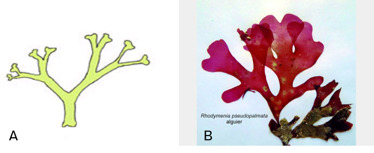
``` 


**Opposée** : Rameaux (filaments) latéraux insérés par 2 sur un même niveau de l’axe (*Figure \@ref(fig:ramif)A*)

**Alternée** : Alternance de l’insertion des rameaux latéraux (*Figure \@ref(fig:ramif)B*)

**Verticilée** : Sur l’axe principal sont insérés plusieurs filaments au même niveau. (*Figure \@ref(fig:ramif)C*)

**Irrégulière** : Rameaux latéraux insérés de façon irrégulière sur l’axe (alterne + opposée) (*Figure \@ref(fig:ramif)D*)

```{r ramif,echo=F,fig.cap="Ramifications A. opposée ; B. alternée ; C. verticilée ; D. Irrégulière",out.width = "70%"}
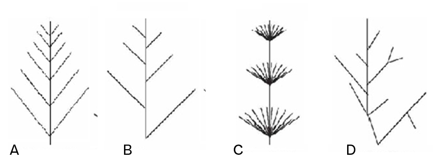
```


## Les différentes fixations

Les algues présentes plusieurs types de fixation qui font partis des critères morphologiques importants pour déterminer le nom d'une espèce. Lors que vous échantillonnez des algues, il est **IMPORTANT** que vous préleviez la fixation.

**Les disques** : simple différenciation du thalle en base arrondie plus ou moins importante (*Figure \@ref(fig:ulvadisque)*).

```{r ulvadisque,echo=F,fig.cap="Disque de fixation chez *Ulva sp.*",out.width = "70%"}
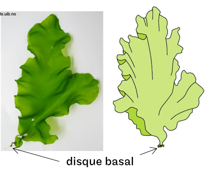
```


**Les rhizoïdes** : Il peut être unicellulaire ou multicellulaire (*Figure \@ref(fig:rhizoide)*). Ce sont des cellules dont la différenciation a abouti à *l'apoptose*, qui sont donc des *cellules mortes*. Les rhizoïdes peuvent être assimilés à des racines mais n'en sont pas. En effet, les racines jouent un important rôle dans l'absorption minérale, ce qui n'est pas le cas des rhizoïdes (*les cellules mortes ne peuvent pas participer aux échanges*).

```{r rhizoide,echo=F,fig.cap="Exemples de rhizoïdes chez A. *Desmarescia sp.*; B. *Polysophinia sp.*",out.width = "70%"}
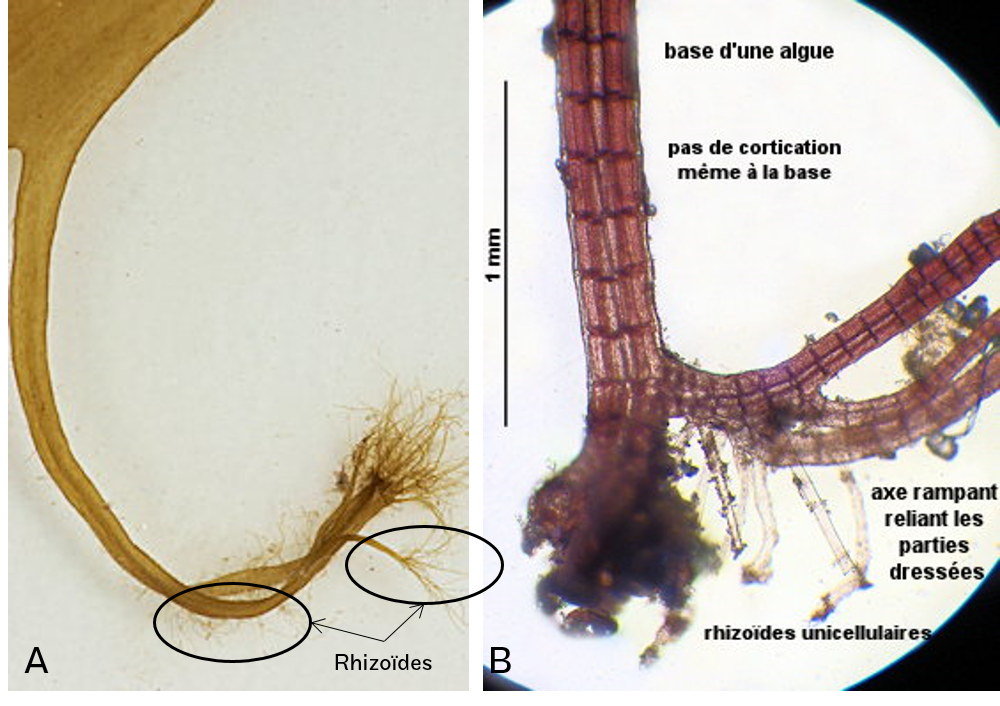
```


**Les stolons** : Base de fixation enfouie dans le sédiment, elle correspond à la partie rampante portant des rhizoïdes sur laquelle se développe les axes dressés (*Figure \@ref(fig:stolon)*). Le stolon est donc la partie rampante, fixée par des rhizoïdes, sur laquelle se développent les axes dressés.

```{r stolon,echo=F,fig.cap="Stolons chez *Caulerpa sp.*",out.width = "70%"}
knitr::include_graphics("./images/caulerpa_stolon.jpg")
```


**Les crampons ou haptères** : ce type de fixation concerne les thalles fucoïdes. Les crampons très efficaces qui permettent de maintenir l'algue accroché à son substrat avec un fort hydrodynamisme. Ils sont volumineux et peuvent abriter une forte richesse spécifique d'invertébrés benthiques et de bactéries (J.-C. Leclerc, 2013).[^2.1]  
On distingue :

* Les haptères formés de ramifications qui s'insèrent dans les infractuaosité du substrat (*Figure \@ref(fig:crampon)A*)

* Les bulbes : le crampon formé de radicelles est recouvert d'un bulbe creux, épais et verruqueux. (*Figure \@ref(fig:crampon)B*)

```{r crampon,echo=F,fig.cap="Exemples d' haptères chez *Laminaria digitata* (A.) et de bulbes chez *Sacchoriza polyschides* (B.)",out.width = "70%"}
knitr::include_graphics("./images/crampons.png")
```


## Les particularités morphologiques

Certaines algues présentent des particularités morphologiques qui permettent de leur donner rapidement un nom. Il est *INDISPENSABLE* que vous connaissiez les algues ayant ces particularités.

### Les aérocystes

Les aérocystes ou vésicules aérifères sont des vésicules plus ou moins volumineuses contenant un mélange gazeux ou de l'air participant à maintenant l'algue dressée lorsqu'elle est immergée. Ces vésicules ont alors le rôle de flotteur.  

Ces vésicules peuvent être :  

  * dans l'axe du thalle (*e.g.* *Ascophyllum nodosum*, *Figure \@ref(fig:aero)A*)
  
  * de part et d'autre de la pseudo-nervure (*e.g.* *Fucus vesiculosus*, *Figure \@ref(fig:aero)B*)
  
  * latéral porté ou non par des pédoncules (*e.g.* *Sargassum muticum*, *Figure \@ref(fig:aero)C*)


```{r aero,echo=F,fig.cap="Vésicules aérifères chez *Ascosphyllum nododum* (A.), *Fucus vesiculosus* (B.), *Sargassum muticum*(C.)",out.width = "70%"}
knitr::include_graphics("./images/aerocystes.png")
```

### Les cils

Ce sont des protubérances formant des épines plus ou moins rigides sur la bordure ou sur l'intérieur du thalle (*e.g* *Calliblepharis ciliata*,*Figure \@ref(fig:calliblepharis)*)

```{r calliblepharis,echo=F,fig.cap="Epines chez *Calliblepharis ciliata*",out.width = "70%"}
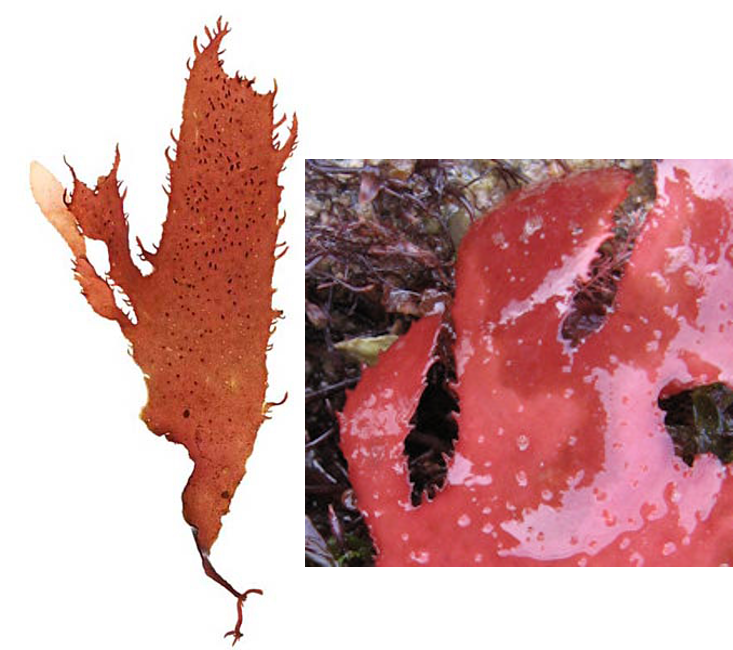
```


### Les ramifications latérales

Certaines algues présentent des ramifications qui ne sont pas dans la continuité de l'axe principal, mais perpendiculaire ou sur la bordure du thalle, leur conférant une structure 3D.  

 * développement de thalles sur la bordure du thalle principal (*e.g.* *Palmaria palmata*, *Figure \@ref(fig:croiss-lateral)A*)
 
 * développement de thalles le long de la pseudo-nervure (*e.g.* *Hypoglossum hypoglossoides*, *Figure \@ref(fig:croiss-lateral)B*)
 

```{r croiss-lateral,echo=F,fig.cap="Exemples de ramifications sur la bordure du thalle chez *Palmaria palmata* (A) et le long de la pseudo-nervure chez *Hypoglossum hypoglossoides* (B)",out.width = "70%"}
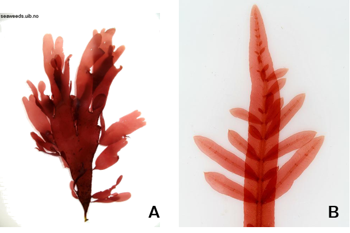
```


### Les pseudo-nervures


Les pseudo-nervures sont spécifiques aux cladomothalles et aux thalles fucoïdes, elles correspondent à un épaississement autour des axes principaux et secondaires de croissances (*Figure \@ref(fig:pseudo-nervure)*). Contrairement aux végétaux supérieurs, il n'y a pas de conduction de sèves dans les pseudo-nervures.

```{r pseudo-nervure,echo=F,fig.cap="Exemples de pseudo-nervures. A. *Undaria pinnatifida*; B. *Delesseria sanguinea*; C. *Alaria esculenta*",out.width = "70%"}
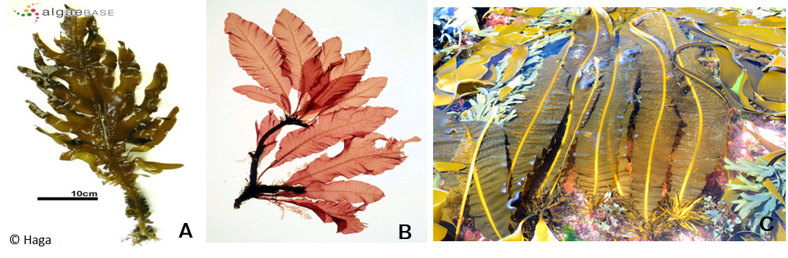
```


### Les ramules

Une ramule est une petite ramification d'un axe de croissance  qui a subit une métamorphose ayant pour conséquence un arrêt de croissance du rameau. Il existe une grande diversité de forme des ramules :  

  * Crosse (*e.g.* *Acrosorium uncinatum*, *Figure \@ref(fig:ramule)A-B*)
  * Harpon (*e.g.* *Asparagopsis armata*, *Figure \@ref(fig:ramule)C-D*)
  * Crochets (*e.g.* *Ceramium sp.*, *Figure \@ref(fig:ramule)E-F*)
  * Peignes (*e.g.* *Plocamium cartilagineum*, *Figure \@ref(fig:ramule)G-H*)
  * Pinnules (*e.g.* *Caulerpa taxifolia*, *Figure \@ref(fig:ramule)I-J*)


```{r ramule,echo=F,fig.cap="Exemples de ramules chez différentes algues. A-B Crosses *Acrosorium uncinatum* ; C-D *Asparagopsis armata* ; E-F Crochets *Ceramium sp.* ; G-H Peignes *Plocamium cartilagineum* ; I-J Pinnules *Caulerpa taxifolia*",out.width = "70%"}
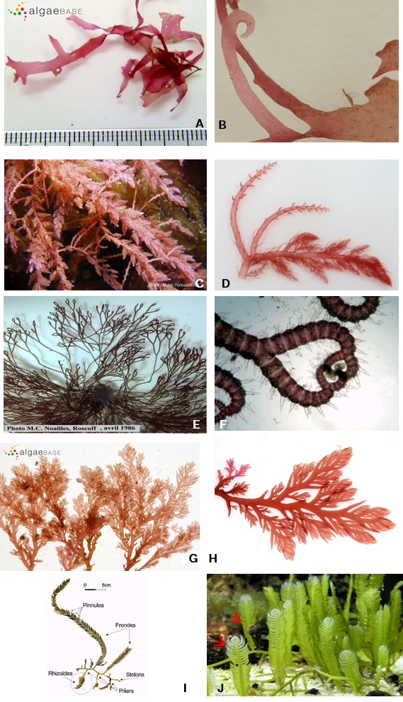
```


[^1.1]: [Volvox, structure et cycle de vie d'une algue verte originale, Planet-Vie, Mercredi 18 mai 2011](http://planet-vie.ens.fr/content/volvox-structure-cycle-vie-algue-verte-originale)

[^2.1]: Jean-Charles Leclerc.  Biodiversité, Structure et Fonctionnement Trophique des communautés à  Laminaria  hyperborea,  en  conditions  naturelles  et  exploitées,  en  Bretagne. Sciences  de l’environnement.  Paris 6, 2013. Français.