# Diversité cytologique des algues {#cytologie}


```{r setup5, include=FALSE}
require(knitr)
opts_chunk$set(echo = FALSE, warning = FALSE, message = FALSE,fig.align = "center", fig.pos = "H")
```

## Introduction 
### Cellule animale *vs.* végétale

Les cellules animales et végétales, bien que partageant certaines caractéristiques fondamentales, présentent des différences structurelles marquées (*Figure \@ref(fig:animalvsvegetal)*) reflétant leurs besoins biologiques distincts. 

L'une des différences les plus évidentes réside dans la présence de la paroi cellulaire chez les cellules végétales, une structure rigide composée de cellulose qui confère une résistance mécanique et une forme stable à la cellule. Les cellules animales, en revanche, ne possèdent pas de paroi cellulaire, ce qui les rend plus flexibles et adaptatives à des environnements changeants.

Un autre aspect distinctif est la présence de chloroplastes dans les cellules végétales, des organites responsables de la photosynthèse. Ces chloroplastes confèrent aux cellules végétales leur couleur verte caractéristique et leur capacité à produire de la matière organique à partir de la lumière solaire, un processus vital pour la croissance et le métabolisme des plantes. Les cellules animales ne possèdent pas de chloroplastes et dépendent plutôt de la consommation d'aliments pour obtenir de l'énergie.

En outre, les cellules végétales ont souvent une grande vacuole centrale, une structure membranaire remplie de liquide cellulaire, qui joue un rôle clé dans le stockage de nutriments, la régulation de la pression cellulaire et l'élimination de déchets. Les cellules animales peuvent également avoir des vacuoles, mais elles sont généralement plus petites et ont un rôle moins central dans le métabolisme cellulaire.

```{r animalvsvegetal,echo=F,fig.cap="Comparaison de la structure d'une cellule animale et d'une cellule végétale",out.width = "70%"}
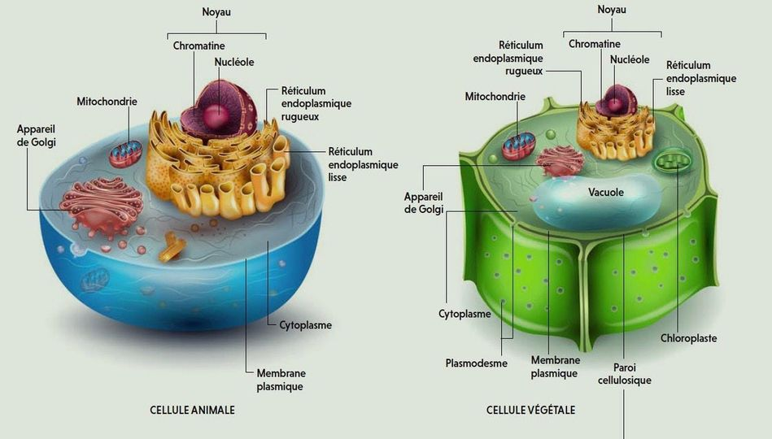
```

### Les technique d'observation de la cellule
#### La microscopie optique

La microscopie optique est une technique largement utilisée pour l'étude des algues. Elle repose sur le principe de l'utilisation de la lumière visible ou d'autres formes de lumière électromagnétique pour observer des échantillons biologiques à une échelle microscopique.


Un microscope optique  (*Figure \@ref(fig:microscopeoptique)*) possède les élements suivants :

+ **Source de lumière artificielle** : Elle présente une température de couleur et une stabilité optimales. Un condenseur est utilisé pour assurer une distribution homogène et régulière de la lumière dans le champ observé. Cela permet de masquer, par un réglage approprié, les détails mécaniques de la source lumineuse tels que les spires du filament de l'ampoule. La source d'éclairage peut être plus élaborée, comportant éventuellement un boîtier indépendant, notamment en lumière polarisée ou ultraviolette, pour mettre en évidence certaines propriétés chimiques de la matière, ou éclairer l'échantillon par-dessus, notamment en métallurgie.

+ **Diaphragme** : Il s'agit d'une ouverture de diamètre variable permettant de réguler la quantité de lumière atteignant l'échantillon. Comme pour un appareil photo, le diaphragme est principalement utilisé pour ajuster la profondeur de champ, en l'ouvrant complètement pour des coupes histologiques et en le fermant davantage pour des recherches d'œufs de parasites digestifs.


+ **Platine porte-échantillon** : C'est la surface sur laquelle l'échantillon est placé. Les "valets" sont utilisés pour maintenir l'échantillon lorsqu'il est mince, comme une lame. La platine peut être mobile, permettant de balayer l'échantillon et de sélectionner la partie à observer.

+ **Objectifs** : Il s'agit de lentilles ou d'ensembles de lentilles responsables du grossissement. Plusieurs objectifs, correspondant à différents niveaux de grossissement, sont généralement montés sur un barillet. Certains objectifs sont dits "à immersion" car leur puissance maximale est atteinte en éliminant l'air entre l'échantillon et la lentille frontale de l'objectif, en utilisant de l'huile de cèdre ou des huiles de synthèse ayant un indice de réfraction proche de celui du verre.

+ **Mise au point rapide et micrométrique** : Pour obtenir une image nette, il est essentiel que l'objet soit dans le plan focal de l'objectif. Les molettes de mise au point permettent de déplacer l'ensemble objectif-oculaire vers le haut ou vers le bas à l'aide d'un système de crémaillère, afin d'ajuster le plan focal sur la zone de l'échantillon à observer.

+ **Oculaire** : Il s'agit d'une lentille ou d'un ensemble de lentilles qui forme une image reposante pour l'œil. Les rayons lumineux arrivent de manière parallèle, simulant une provenance de très loin, ce qui permet un relâchement des muscles contrôlant le cristallin. L'utilisation de deux oculaires sur une tête binoculaire rend l'observation plus confortable, bien que cela n'apporte pas de vision stéréoscopique.

```{r microscopeoptique,echo=F,fig.cap="Description d'un microscope optique",out.width = "70%"}
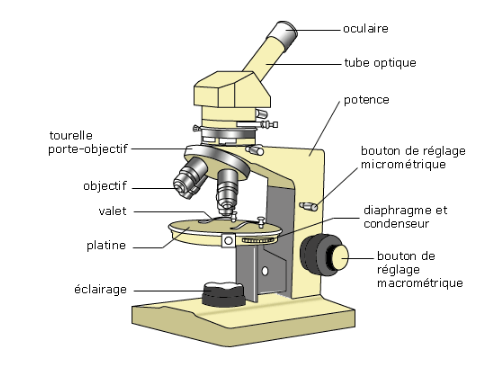
```

#### La microscopie à balayage

Le microscope électronique à balayage (MEB) joue un rôle crucial en biologie végétale en permettant une analyse détaillée de la morphologie et de la structure des cellules et des tissus végétaux. En MEB, l'échantillon est préparé en vue d'une observation détaillée de sa surface, des revêtements métalliques peuvent être appliqués pour améliorer la conductivité électrique.

Un MEB (*Figure \@ref(fig:meb)*) possède les éléments suivants : 

+ **Source d'électrons** : Un faisceau d'électrons est utilisé pour sonder la surface de l'échantillon. Ce faisceau est généré par un canon à électrons situé dans la colonne électronique du microscope.

+ **Bobine de Balayage** : La bobine de balayage dirige le faisceau d'électrons sur la surface de l'échantillon de manière systématique et méthodique. Cette procédure permet de générer des signaux caractéristiques en fonction des propriétés de la surface, contribuant à la création d'une image tridimensionnelle détaillée.

+ **Détection des Signaux** : Les interactions entre le faisceau d'électrons et la surface de l'échantillon génèrent divers signaux, tels que des électrons rétrodiffusés, des électrons secondaires, et des rayons X caractéristiques. Ces signaux sont détectés et utilisés pour créer une image représentative de la topographie et de la composition chimique de la surface.

Il offre une résolution élevée, permettant d'observer des détails extrêmement fins à l'échelle nanométrique. Cela permet une visualisation précise de la morphologie et de la structure des échantillons.


```{r meb,echo=F,fig.cap="Description d'un microscope optique",out.width = "70%"}
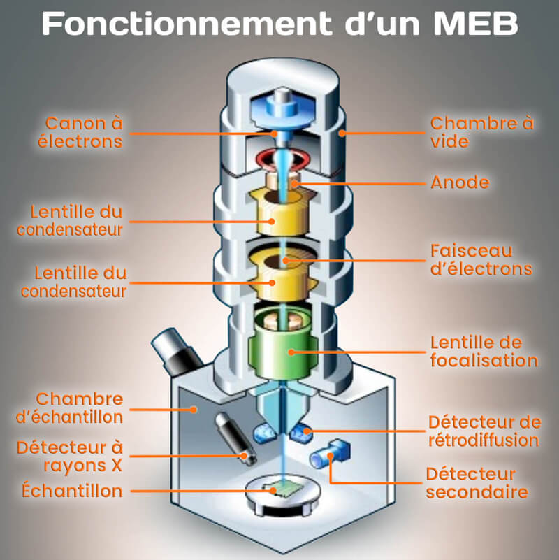
```

#### Synthèse

| **Microscopie optique** 	| **Microscopie à balayage** 	|  	|  	|  	|
|---	|---	|---	|---	|---	|
| Elle utilise la lumière visible pour observer les échantillons. Il est  particulièrement adapté à l'observation de structures biologiques  transparentes ou légèrement colorées. 	| Il utilise un faisceau d'électrons pour sonder la surface de l'échantillon.  Il est adapté à l'observation de détails fins à l'échelle nanométrique. 	|  	|  	|  	|
| ils sont généralement utilisés pour des grossissements modérés, allant jusqu'à environ 1000x. 	| La MEB offre une résolution nettement plus élevée que les microscopes  optiques, ce qui permet d'obtenir des images détaillées de la  topographie de la surface et de la composition chimique. 	|  	|  	|  	|
| Les microscopes optiques permettent une observation en temps réel, ce  qui est utile pour étudier des processus dynamiques ou pour la sélection  rapide d'aires d'intérêt. 	| La MEB permet la génération d'images tridimensionnelles détaillées de la surface de l'échantillon. 	|  	|  	|  	|


## Les plastes 
### Qu'est-ce-qu'un plaste?

Les plastes sont des organite spécifiques des cellules végétales concentrant des substances (pigments, lipides, protéines) qui possèdent **une double membrane et un ADN propre.**

  * Les leucoplastes sont des plastes de réserve, ils stockent lipides, protéines et amidon
  * Les chromoplastes sont des plastes responsables de la pigmentation, ils stockent des pigments (notamment des caroténoïdes)
  * Les chloroplastes sont le siège de la photosyntèse, ils convertissent la matière minérale en matière organique à l'aide de l'énergie lumineuse.


### La théorie de l'endosymbiose
#### Parasitisme *vs.* symbiose

Dans le cas du parasitisme, le parasite va utiliser son hôte à ces propres fins pour se nourrir, se reproduire (*e.g.* les champignons parasites). Dès qu'il n'a pas plus besion de l'hôte, il est capable de le tuer ou de l'abandonner mais l'hôte très affaiblit ne pourra pas survivre.

Pour la symbiose c'est totalement différent, le symbionte va être absorber et non ingérer par l'hôte qui va se servir du symbionte. Néanmoins l'hôte va subvenir aux besoins du symbionte. C'est le principe de "donnant-donnant".

#### L'endosymbiose

Dès le début du XX^ème^ siècle, les chercheurs ont pensé que les plastes et les mitochondrie provenaient de bactéries ingérées par des cellules primitives. Ces bactéries non digérées et non assimilées vivraient à l'intérieur des cellules primitives en symbiose.  
Suite à des études approfondies de l'ultrastructure des plastes et des mitochondries par des analyses protéomiques, génomiques et phylogénétiques dans des cellules eucaryotes, il a été démontré que leur présence résulte de l'endosymbiose de bactéries archaïques [^6.1] :  

  1. **Mitochondrie et chloroplastes possèdent de l'ADN** qui codent pour des caractères qui leurs sont propres
  
  2. Le code génétique n'est pas tout à fait identique à celui des eucaryotes, il est plus proches des procaryotes
  
  3. Les ribosomes chloroplastiques et mitochondriaux sont phylogénétiquement plus proches de ceux des procaryotes.
  
  4. La structure de la membrane interne de ces organites est très proche de celle d'une bactérie car très riche en protéines. Cette organisation laisse penser que les bactéries ont été phagocytées.
  

> *Rappel sur la phagocytose* :
La phagocytose est le processus par lequel des cellules eucaryotes ingèrent de grosses particules (>0.5µm), par exemple des bactéries. Elle est souvent découpé en trois phases : adhésion, ingestion, et digestion. 

>  1. Adhésion : la membrane de la cellule phagocytaire adhère à la particule qu'elle va ingérer. Cette étape se fait grâce aux *lectines (glucoses complexes)* qui se trouvent à la surface du corps étranger. Des liaisons se forment entre les glycoprotéines membranaires des cellules immunitaires et les oses du corps étranger.
  2. Ingestion :  la particule phagocytée est entourée par les pseudopodes de la cellule et entre ces pseudopodes se forme une nouvelle vacuole intracellulaire, **le phagosome**. 
  3. Digestion: La phagocytose s’accompagne le plus souvent d’une brutale élévation de la consommation cellulaire en oxygène. En effet, la liaison d’une particule exogène à son récepteur membranaire entraîne une activation de la NADPH oxydase, qui transfère des électrons du NADPH à l'oxygène moléculaire. Les formes actives de l'oxygène formées (H~2~O~2~, radicaux OH^-^ et O~2~) se retrouvent en forte concentration dans le phagosome, où elles exercent des effets toxiques sur les micro-organismes phagocytés. 


Toutes ces preuves étayent la théorie endosymbiotique découverte entre 1950 et 1960. Ceci est d'autant plus conforté par la forte ressemblance entre les chloroplastes de cellules eucaryotes photosynthétiques et des bactéries photosynthétiques (cyanobactéries). Les endosymbioses ont pu se réaliser à différents moments et de diverses façons, par absorption par une cellule (Procaryote ou Eucaryote) primitive d'une autre cellule (Procaryote ou Eucaryote). **On parle alors d'endosymbiose primaire ou secondaire.**

  + **L'endosymbiose I^aire^**
  
L'endosymbiose I^aire^ sera à l'origine des plastes des rhodophycées et des chlorophycées.  

Lors de l'**endosymbiose I^aire^**, *une cellule eucaryote hétérotrophe va phagocyter une bactérie photosynthétique sans entrainer la lyse de la membrane bactérienne* (*Figure \@ref(fig:endoprimaire)*). Cette bactérie va devenir **un chloroplaste à deux membranes**, la membrane interne a une origine bactérienne et la membrane externe a pour origine la membrane plasmique de la cellule ayant phagocyté. Cette endosymbiose primaire est à l'origine de la lignée verte (Chlorophytes et plantes supérieures) et de la lignée rouge (Rhodophytes).
Comme nous l'avons vu dans le cours d'introduction, rhodophycées et chlorophycées diffèrent par la composition en pigments accessoires et notamment les rhodophycées possèdent des phycobiloprotéines également présentent dans les cyanobactéries, ce qui conforte d'autant plus la théorie de l'endosymbiose. Pour les chlorophycées et les plantes supérieures, deux hypothèses subsistent concernant l'absence de phycobiloprotéines :  

  1. la cyanobactérie possédait une composition pigmentaire différente lors de absorption
  2. au cours du temps les phycobiloprotéines ont disparu car elles n'étaient pas utiles.


```{r endoprimaire,echo=F,fig.cap="Schéma explicatif de l'endosymbiose primaire",out.width = "70%"}
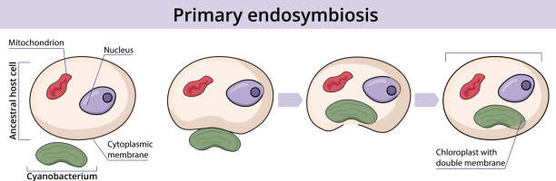
```


  + **L'endosymbiose II^aire^**

Lors de l'**endosymbiose II^aire^**, *une cellule eucaryote hétérotrophe va phagocyter une cellule eucaryote autotrophe sans entrainer la lyse de la membrane plasmique* (*Figure \@ref(fig:endosecondaire)*). Le noyau et le cytoplasme dégénère, le chloroplaste est alors entouré de **4 membranes** (de l'intérieur vers l'extérieur du plaste) :   

  1. membrane bactérienne
  2. membrane plasmique (endosymbiose I)
  3. membrane plasmique (cellule phagocytée)
  4. membrane plasmique (cellule phagocytant)
  
En fonction de la cellule autotrophe phagocytée appartenant à la lignée verte ou la lignée rouge de nouveaux taxa sont apparus:

  - \textcolor{green}{à partir de la lignée verte}: Chlorarachniophytes
  - \textcolor{red}{à partir de la lignée rouge}: Cryptophytes, Hétérokontophytes, Haptophytes

Pour certains taxa (*Euglénophytes et Dinophytes*), le chloroplaste ne possède que 3 membranes et non 4 membranes. Deux hypothèses permettent de justifier ce phénomène :

  1. Au cours de l'évolution, une membrane a disparu par fusion ou par lyse
  2. La cellule autotrophe a été absorbée par *myzocytose*, *i.e.* la cellule qui absorbe va détruire la membrane plasmique de la cellule cible et va absorber le contenu cellulaire.

```{r endosecondaire,echo=F,fig.cap="Schéma explicatif de l'endosymbiose secondaire",out.width = "70%"}
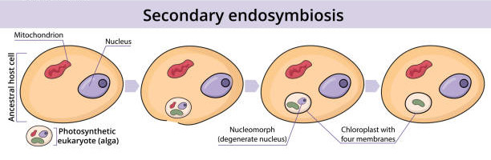
```


### Ultrastructure du chloroplaste [^6.4]

Le chloroplaste (*Figure \@ref(fig:chloropultra)*) est un organite composé de deux membranes séparées par un espace inter-membranaire . Il contient un réseau membraneux constitué de sacs aplatis nommés thylakoïdes qui baignent dans le stroma (liquide intra-chloroplastique). Les thylakoïdes sont composés d'un lumen entouré d'une membrane et contiennent des pigments. Un empilement de thylakoïdes se nomme granum (au pluriel : des grana). Dans le stroma se trouve des réserves sous forme d'amidon. 
De plus, les chloroplastes contiennent de l' ADN regroupé en nucléoides. Les ribosomes sont constitués d' ARNr, synthétisés dans les chloroplastes, et de protéines codées par les génomes nucléaires et chloroplastiques. 

```{r chloropultra,echo=F,fig.cap="Ultrastructure d'un chloroplaste",out.width = "70%"}
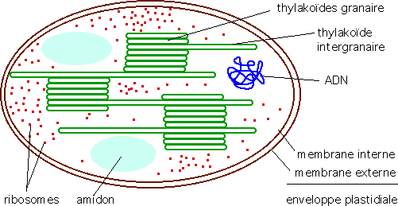
```

Chez les algues, les chloroplastes contiennent les chlorophylles a, b ou c ou d ou e, ce sont les pigments photosynthétiques, mais seule la chlorophylle a est capable de réaliser la conversion de l’énergie lumineuse en énergie chimique et les ions minéraux (dioxyde de carbone notamment) en matière organique.

#### Structure archéoplastidiée

Une structure archéoplastidée se caractérise par la présence d'un seul chloroplaste plus ou moins lobé de grande taille.

La position du plaste peut être : 

  * *pariétal* : le plaste sur situe le long de la paroi de la cellule (*i.e* [Ulva](https://doriscdn.ffessm.fr/var/doris/storage/images/images/ulva-compressa_mv/3088033-1-fre-FR/ulva-compressa_mv_image1200.jpg) )
  * *focal* : le plaste se situe au centre de la cellule (*i.e* Porphyra )
  * *ceinturant* : le plaste entoure le noyaux et d'autres organites (*i.e* [Ulothrix](https://labsuppliesusa.com/wp-content/uploads/2018/02/ulothrix1.jpg))
  
#### Structure mésoplastidiée

Une structure mésoplastidiée (*Figure \@ref(fig:mesoplastidiee)*) se caractérise par un réseau de territoires plastidiaux reliés par des trabécules. Chaque territoire peut posséder ou non un pyrénoïde. La forme en réseau est la seule forme existante.

```{r mesoplastidiee,echo=F,fig.cap="Structure mésoplastidée de *Cladophora sp.* (d'après Ruen-Pham et al. 2021)",out.width = "50%"}
knitr::include_graphics("https://www.researchgate.net/publication/355551479/figure/fig1/AS:1083018928238592@1635223242615/Morphological-characteristic-of-Cladophora-sp-collected-from-Nan-River-Thailand-and.jpg")
```  

#### Structure néoplastidiée

Une structure néoplastidiée  se caractérise par de nombreux plastes avec ou sans pyrénoïdes répartis dans chaque cellule. Cette structure est présente dans la plupart des algues et des végétaux supérieurs. Les plastes peuvent être discoïdes ou rubannées.
Chez les Chlorophytes on distingue *le type homoplastidié* correspondant à des plastes ayant tous la même structure et *le type hétéroplastidié* dans lequel il y a une différenciation entre des chloroplastes assurant la photo-synthèse et des amyloplastes assurant le stockage de l'amidon 


```{r neoplastidiee,echo=F,fig.cap="Structure néoplastidiée de *Pylaeilla littoralis*",out.width = "70%"}
knitr::include_graphics("https://www.ccap.ac.uk/catalogue/image/cache/catalog/strainImages/image_3453_6399-800x600.png")
```

### Les thylakoïdes

Les thylakoïdes sont des "sacs" se situant à l'intérieur du chloroplaste et baignant dans le stroma. Ils sont le siège de la phase claire de la photosynthèse en convertissant l'énergie lumineuse en énergie chimique. L'agencement des thylakoïdes dans le chloroplaste peut être caractéristique de certains taxa.


```{r thylakoide,echo=F,fig.cap="Le thylakoïde siège de la phase claire de la photosynthèse.",out.width = "60%"}
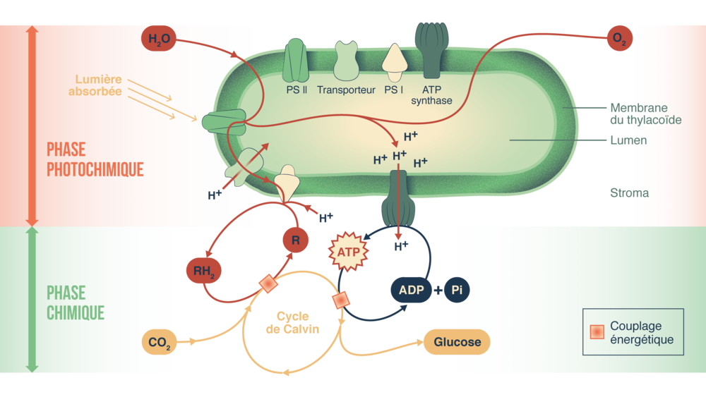
```

#### Les thylakoïdes isolés

**Cynaobactéries** : Les thylakoïdes sont isolés dans le cytoplasme en périphérie de la cellule. Ces bactéries portent des phycobilosomes, complexes de phycobiliprotéines formant des antennes collectrices de photons.

**Rhodophytes** : Les thylakoïdes sont également isolés dans le stroma du chloroplaste et porte des phycobilosomes.

> Cette forte ressemblance entre cyanobactérie et rhodophyte corrobore la théorie d'endosymbiose toutefois le genre ou la famille de la cyanobactérie qui a été phagocytée n'est pas encore ellucidé.


#### Les thylakoïdes accolés par deux

**Les prochlorophytes** sont des bactéries photosynthétiques communément trouvé comme symbiote dans les récifs de corail, particulièrement dans les cellules d'ascidiacea. Faisant partie du phylum des Cyanobactéries, la théorie endosymbiotique avait théorisé que Prochloron était le prédécesseur du chloroplaste des cellules végétales eucaryotes. Néanmoins, des études phylogénétiques ont réfuté cette théorie.

**Les cryptophytes** sont des organismes eucaryotes unicellulaires, photosynthétiques.


#### Les thylakoïdes accolés par trois

On trouve cet arrangement dans les groupes suivants:

   * les Haptophyta
   * les Chrysophyceae
   * les Dinophyta
   * les Chlorarachniophyceae 
   * les Euglenophyta 
   * les hétérokontophytes
   
Les hétérokontophytes ont une particularité, les chloroplastes présentent une lamelle périphérique faisant le tour du plaste.


#### Les thylakoïdes avec granum(a)

Les thylakoïdes sont empilés par 2 (et jusqu’à 7) sur toute la longueur ou sur une grande partie (granum). Cet arrangment est caractéristique des **chlorophytes**, des **streptophytes** (groupe frère des chlorophytes) et des **plantes supérieures**.

```{r grana,echo=F,fig.cap="Observation en microscopie à transmission de grana d'un chlorophyte",out.width = "60%"}
knitr::include_graphics("https://upload.wikimedia.org/wikipedia/commons/thumb/7/71/Lettuce_Thylakoid.jpg/250px-Lettuce_Thylakoid.jpg
")
```


### Les organites complémentaires de la photosynthèse

Le pyrénoïde est une structure cellulaire interne aux plastes de certaines lignées végétales, qui concentre les enzymes responsables de la photosynthèse, notamment la RubisCO (qui fixe le dioxyde de carbone) et l'anhydrase carbonique (qui concentre le dioxyde de carbone à proximité de la RubisCO). Des grains d'amidon, ou une gaine d'amidon, viennent s'accoler à l'extérieur du pyrénoïde.


```{r pyrenoid,echo=F,fig.cap="Observation en microscopie par transmission du pyrénoïde (P) entouré par l'amidon. Le pyrénoïde se situe à l'intérieur du chloroplaste (c) ",out.width = "60%"}
knitr::include_graphics("https://www.researchgate.net/publication/268432265/figure/fig1/AS:668919937388546@1536494349361/Pyrenoid-p-with-homogenous-starch-sheath-and-additional-stroma-starch-grains-s-in-the.ppm")
```


## La paroi cellulaire 

### Ultra-structure

La paroi cellulaire (*Figure \@ref(fig:structureparoi)*) constitue un cytosquelette externe, elle est consituée de :  

  * **La lamelle moyenne** : membrane pectidique qui est un support pour l'élaboration de la paroi primaire et de la paroi secondaire.
  * **La paroi primaire** : paroi des plus jeunes cellules, elle est souple et hydrophile permettant aux cellules de croitre et de se diviser. Cette paroi participe à la régulation de la croissance et également à l'équilibre hydrique.
  * **La paroi secondaire** : paroi des cellules les plus agées, elle a principalement un rôle de consolidation et de soutien en raison des parois plus rigides.
  * **Les plasmodesmes** : Les plasmodesmes sont des communications intercellulaires qui traversent la paroi. Ils sont formés lors de la constitution de la paroi à la fin de la division cellulaire. Vue de profils, ils apparaissent comme des canaux complexes, limités par la membrane plasmique et traversés par un tractus en rapport avec le réticulum endoplasmique. Les communications ne sont pas une libre circulation passive mais sont très sélectives.
  * **Les synapses** :

```{r structureparoi,echo=F,fig.cap="Schéma simplifié de l'organisation structurale de la paroi végétale ",out.width = "60%"}
knitr::include_graphics("https://www.cours-pharmacie.com/images/paroi-vegetale-structure.png")
```

### Composition
#### Lamelle moyenne

c'est la partie la plus externe de la paroi (dépourvu de cellulose) et elle est commune à deux cellules contiguës. C'est elle qui se forme la première et elle est constituée de matières pectiques seulement.

#### La paroi primaire

Les parois primaires contiennent des molécules de cellulose. Ces molécules de cellulose (chaînes de béta glucose) sont associées sous forme de microfibrilles. Elle est extensible, ce qui permet la croissance cellulaire

#### La paroi secondaire

elle apparaît lors de la différenciation de la cellule. Elle est constituée de cellulose et d'hémicellulose et est enrichie en composés phénoliques :

+ lignine (pour renforcer la rigidité), 

+ cutine et subérine (pour l'imperméabiliser). 

Cette différenciation s'observe pour les cellules conductrices de sève du xylème (le bois) et pour différents tissus de soutien (sclérenchyme) ou de protection (liège).

### Mucilage et imprégnation

Au cours de l’évolution de certaines cellules, les parois peuvent subir des modifications plus ou moins importantes ; certaines en une transformation chimique en gommes ou mucilages ; d’autres en une incrustation de la paroi.

#### La minéralisation

La minéralisation correspond à un dépôt de silice (SiO2) ou alors à un dépôt de calcaire (carbonate de calcium, CaCO3) au niveau de tissus spécifiques de la plante. 

+  Le dépôt de silice s’appelle la silification et se fait au niveau de certaines plantes
uniquement, non comestibles par les herbivores. Les Poacées et les Cypéracées
possèdent des épidermes riches en silices ; on prendra pour exemple les poils urticants
des orties.

+ Le dépôt de calcaire s’effectue au niveau des poils en les rigidifiant.

#### Gélification par des mucilages

La gélification correspond à une hypertrophie de la lamelle moyenne, par des mucilages. Les mucilages sont des polysaccharides hétérogènes dont le poids moléculaire est inférieur à la cellulose. Ce sont des macromolécules hydrophiles colloïdales, c’est-à-dire qu’elles peuvent passer en solution dans l’eau sans être ionisées, et ceci en restant en suspension dans la solution. Elles ont la propriété de gonfler au contact de l’eau et de former des masses gélatineuses.

## Les flagelles et cils

Les flagelles et les cils sont des structures piliformes provenant de différentes cellules. Ils sont relativement mince et ont un **diamètre constant** mais leur longueur varie entre 2 et 150 $\mu$m. Par convention, les flagelles sont plus long et moins nombreux alors que les cils sont courts et nombreux

### Composition

Chaque flagelle possède une organisation interne précise que l'on retrouve chez tous les organismes eucaryotes flagellés:

+ Un anneau externe de neuf paries de microtubules
+ 2 microtubules au centre

```{r flagelle, echo=FALSE, fig.cap= "Structure interne d'un flagelle d'eucaryote", fig.align='center'}

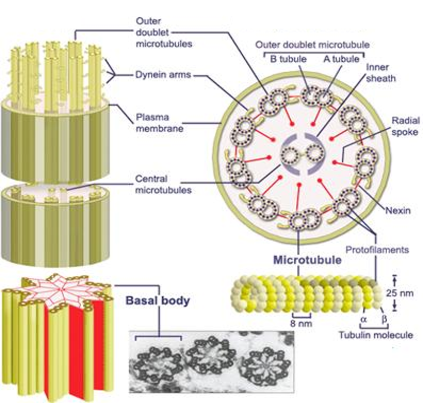

```

Le mouvement est produit par le glissement des microtubules. Ce glissement est produit par des cycles d'attachement détachement de liaisons (bras de dynéine) qui contiennent des enzymes et se trouvent entre les paires voisines de l'anneau externe.


```{r microtubule, echo=FALSE, fig.cap= "Mouvement entre deux paires de microtubules dans un flagelle d'une cellule eucaryote", fig.align='center'}

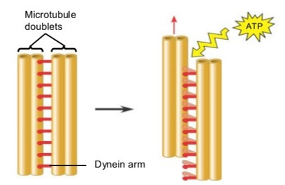

```

### Structure

Le nombre de flagelle est variable, majoritairement on en dénombre 1,2 ou 4 mais certaines cellules peuvent en avoir beaucoup plus.

Il existe une grande diversité structurale externe des flagelles. En effet, ils peuvent être lisses ou porter des expansions latérales fibrillaires appelées des mastigonèmes.

+ Si le flagelle possède une rangée de mastigonèmes, on parle de **flagelle stichonématés**
+ Si le flagelle possède deux rangées de mastigonèmes, on parle de **flagelle pleuronématés**

```{r mastigonemes, echo=FALSE, fig.cap= "Les mastigonèmes présents sur les flagelles. A gauche un flagelle stichonématés et à droite un flagelle pleuronématés", fig.align='center'}

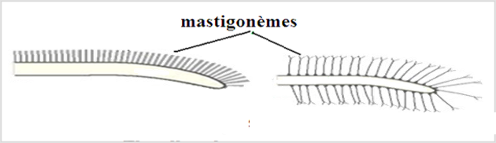

```

Selon la structure et l'aspect des flagelles, nous pouvons distinguer :

+ La cellule **isokontée** : les flagelles possèdent la même longueur et la même structure
+ La cellule **anisokontée** : les flagelles ont une longueur différente mais leur structure est identique
+ La cellule **hétérokontée** : Les flagelles ont une longueur et une structure différente
+ La cellule **stéphanokontée** : Les flagelles sont nombreux et sont répartis en couronne ou sur toute la surface de la cellule

```{r cellules-flagelles, echo=FALSE, fig.cap= "Différentes structures flagellaires chez les eucaryotes", fig.align='center'}

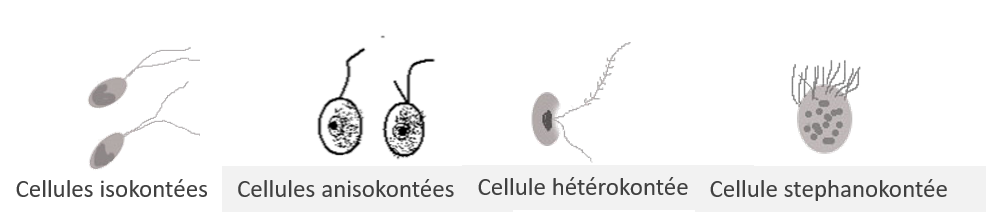

```

Il faut également distinguer la zone d'insertion des flagelles :

+ Cellule **acrokontée** : insertion en position apicale. La cellule est donc tractée
+ Cellule **basikontée** : insertion en position basale. La cellule est donc propulsée
+ Cellule **pleurokontée** : insertion en position latérale.

*Cas particulier des dinoflagellés*

Les deux flagelles sont insérés dans 2 sillons perpendiculaires l'un à l'autre. Le flagelle dans le sillon transversal assure la propulsion et le flagelle longitudinal dirige la nage.

```{r dinoflagelles-flagelle, echo=FALSE, fig.cap= "Organisation flagellaire chez des dinoflagellés", fig.align='center'}

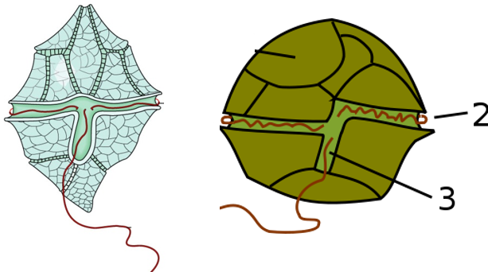

```


### L'haptonème

Chez certaines algues unicellulaires flagellées, on observe un appendice, + ou – long, qui émerge de la cellule entre deux flagelles que l'on nomme l'haptonème. Ce n'est pas un flagelle car il ne possède pas le même nombre de microtubule et par conséquent il possède une plus grande mobilité. Il peut aussi bien prendre la forme d’un tire-bouchon ou d’un ressort que d’un harpon ou d’un crochet).

L'haptonème est présent uniquement chez les **Haptophytes** (*e.g.* coccolithophoridées)

L'haptonème jouerait au moins trois rôles important :

- **Rôle sensoriel de détection d’obstacle** ; chez certains coccolithophores, l'haptonème est atrophié et quand il est présent semble de même nature morphologique que chez les espèces proches, mais moins fonctionnel que chez d'autres espèces6. On a cependant observé que chez ces espèces, quand l'haptonème touche un obstacle, la cellule inverse rapidement son mouvement de natation et recule6. On ignore si c’est une fonction ancienne qui a été conservée, ou si c’est une fonction nouvellement acquise alors que d’autres ont été perdues.
- **rôle d’ancrage** (sur un substrat ou une « proie »).
- **rôle dans la nutrition cellulaire** (collecte de particules nutritives dans le milieu)

## Les organites originaux 

Certains taxa possèdent des organites originaux permettant de s'adapter à l'environnement.

### Les physodes chez les algues brunes

Les physodes des Phéophycées sont des globules ou des vésicules, à contenu principalement phénolique (phlorotannins) ou tanoïde, qu'on observe en grande abondance dans les cellules de ces Algues. Les phlorotanins sont classés en fonction de l'arrangement de leur monomères de phloroglucinol. Plus de 150 composés sont connus, dont la masse moléculaire varie de 126 Da à 650 kDa. La plupart font entre 10 et 100 kDa. 

```{r phloroglucinol, echo=FALSE, fig.cap= "Structure du phloroglucinol", fig.align='center'}

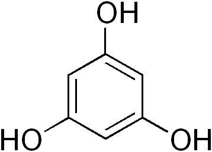

```


```{r eckol, echo=FALSE, fig.cap= "Molécule d'eckol, phlorotanin présent chez les espèces du genre Ecklonia.", fig.align='center'}


```

Les physodes peuvent être mises en évidence par coloration au bleu de Crésyl ou par observation sous lumière UV en microscopie à épi-fluorescence.

```{r physode, echo=FALSE, fig.cap= "Observation sous lumière UV d’un zygote de Fucus", fig.align='center'}

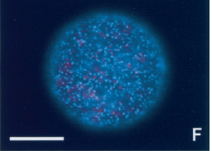

```

Ces physodes permettent par la présence de phlorotannins :

- une résistance/défense contre les rayonnements UV,
- anti-broutage par les herbivores
- un rôle structurel dans la paroi cellulaire
- un rôle reproductif en contribuant à la formation de la paroi cellulaire du zygote (issu de la fécondation)


### Les vacuoles pulsatiles chez les algues d’eau douce

Ces organites intracellulaires sont responsables du maintien de l'équilibre osmotique en régulant la pression osmotique interne. Les vacuoles pulsatiles agissent comme des organes de pompage, alternativement se remplissant et se vidant rythmiquement pour expulser l'excès d'eau accumulé par osmose. Ce mécanisme de régulation osmotique est crucial pour la survie des algues d'eau douce dans des environnements variables, où les conditions hydriques peuvent fluctuer. De plus, les vacuoles pulsatiles jouent un rôle dans l'élimination des déchets métaboliques et peuvent également être impliquées dans le stockage de nutriments et d'autres substances vitales pour la cellule. 

### les corps mucifères

Ces structures cellulaires spécialisées sont souvent constituées de sécrétions mucilagineuses, formant des zones gélatineuses à l'intérieur ou à la surface des cellules. Les corps mucifères remplissent diverses fonctions cruciales. Ils peuvent servir de mécanisme de protection contre la dessiccation en emprisonnant l'eau et en formant une barrière contre les conditions environnementales défavorables. De plus, ces structures mucilagineuses peuvent jouer un rôle dans l'adhérence cellulaire, facilitant l'ancrage des algues aux substrats et favorisant leur stabilité dans des habitats avec un hydrodynamisme important. Les corps mucifères sont également impliqués dans la capture de particules nutritives, contribuant ainsi au processus d'alimentation des algues. 
```{r cpsmucifere, echo=FALSE, fig.cap= "Illustration d'une euglène avec les corps mucifères à proximité du flagelle.", fig.align='center'}

knitr::include_graphics("https://www.universalis.fr/typo3temp/assets/_processed_/b/c/csm_v090018_05eb4e428c.webp")

```

### Trichocystes

Les trichocystes sont des organites spécialisés présents chez certaines algues, contribuant à leur mécanisme de défense et à leur capacité de capture alimentaire. Ces structures, souvent observées chez les cryptophytes, sont des organes éjectables présents à la surface des cellules des algues. En réponse à des stimuli externes, tels que la présence de prédateurs potentiels ou d'autres stimuli environnementaux, les trichocystes se déploient rapidement, libérant des filaments protéiques extrêmement fins. Ces filaments peuvent immobiliser des organismes prédateurs ou des particules alimentaires, offrant ainsi à l'algue une stratégie défensive et alimentaire.

```{r trichocyste, echo=FALSE, fig.cap= "Observation en microscopie optique de *Cryptomonas* en mettant en évidance les trichocystes dans l'éjectosome et le flagelle.", fig.align='center'}

knitr::include_graphics("https://lh3.googleusercontent.com/proxy/UVtb9VgLl9az1NMt7yEZDzSCFsQ4N9j6fuCO7El148UtzHHxrhXVfJbHN-s0ErD7w95vGxzNH4tJLPpUE7Vg-o3VAKHdYJU62Llbq400rAxPMjsk8blP1Gxi264279powQM")

```


### L’iridescence [^6.2] [^6.3]

Structural mechanisms capable of producing color can vary in dimensions, complexity and ordering (e.g., ranging from periodic structures to highly disordered). Marine macroalgae employ different strategies to produce complex optical responses using different architectures and materials. These intracellular inclusions, distributed throughout the epidermis, consist of highly packed vacuoles with multiple dense, proteinaceous globules scattered throughout a matrix of polysaccharides and an osmiophilic material. Cystoseira stricta is suggested to contain protein within the inclusions, however the presence of proteins may differ between species 


```{r irid1, echo=FALSE, fig.cap= "Morphologie et couleur structurelle de *C. tamariscifolia*. (A) *C. tamariscifolia* sur le site de collecte montrant une couleur structurelle. (B) Image à faible grossissement (barre d'échelle, 500 μm) d'un spécimen avec deux couleurs différentes. Gros plan des extrémités des spécimens bleus (C) et verts (D). Barres d'échelle, 50 μm. (E et F) Vésicules individuelles dans les cellules épidermiques de deux spécimens différents sous un microscope optique à fort grossissement. Barres d'échelle, 2 μm. [^6.3]", fig.align='center'}

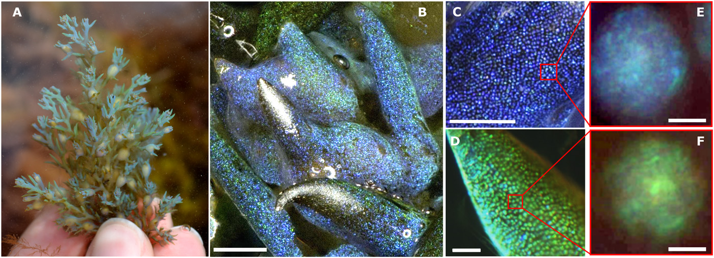

```

```{r irid2, echo=FALSE, fig.cap= "Structure et composition des OPC (organites de pigments chromatiques). (A) Image Cryo-SEM d'une cellule épidermique. Barre d'échelle, 2 μm. Les flèches indiquent les positions des OPC (en trait plein) et des chloroplastes (en pointillés) à l'intérieur de la cellule. (B) Coupe transversale d'une cellule épidermique unique (image TEM). Barre d'échelle, 2.5 μm. (C) Nanosphères en configuration quasi-compacte. Barre d'échelle, 1 μm. (D) Images confocales de fluorescence en fausses couleurs des cellules épidermiques pour la chlorophylle (vert) et le colorant lipophile Nile red (rouge). Barre d'échelle, 10 μm. (E) Croquis de la position des OPC (en bleu) et des chloroplastes (en vert) à l'intérieur des cellules épidermiques.[^6.3]", fig.align='center'}

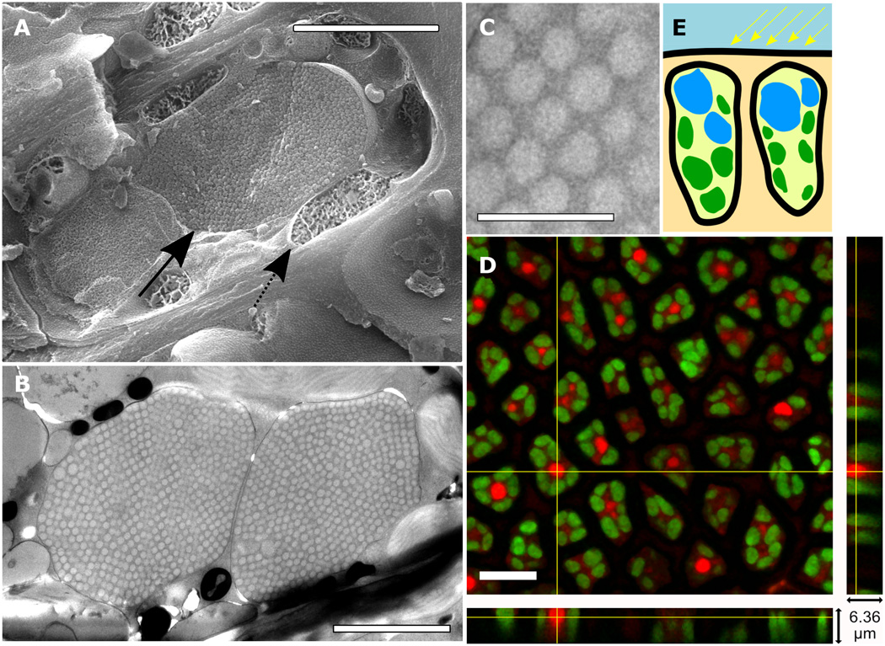

```

### Les cellules spécialisées


[^6.1] :[Delwiche, C. F. (1999). *Tracing the thread of plastid diversity through the tapestry of life*. the american naturalist, 154(S4), S164-S177.](https://www.jstor.org/stable/pdf/10.1086/303291.pdf?casa_token=1S1RBVv7DnoAAAAA:KD7rJTcllPzH9uKQacTyUmQHsDvU-MitqyvzG5nbTgH3ENazdPfK1nkSeWSLLD94UGx1wZZuWyANt3Nq-Qo8-qlVnV_iHvPF1r6uqb_xlg39wNgjuko)

[^6.2] : [Chandler, C. J., Wilts, B. D., Brodie, J., & Vignolini, S. (2017). *Structural color in marine algae*. Advanced Optical Materials, 5(5), 1600646.](https://onlinelibrary.wiley.com/doi/10.1002/adom.201600646)

[^6.3] : [Lopez-Garcia, M., Masters, N., O’Brien, H. E., Lennon, J., Atkinson, G., Cryan, M. J., ... & Whitney, H. M. (2018). *Light-induced dynamic structural color by intracellular 3D photonic crystals in brown algae*. Science advances, 4(4), eaan8917.](https://www.science.org/doi/pdf/10.1126/sciadv.aan8917)

[^6.4] [Staehelin, L. A. (2003). *Chloroplast structure: from chlorophyll granules to supra-molecular architecture of thylakoid membranes. Photosynthesis research*, 76, 185-196.](https://www.life.illinois.edu/govindjee/Part2/16_Staehelin.pdf)
