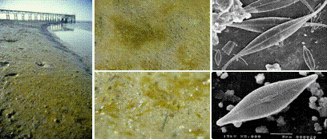
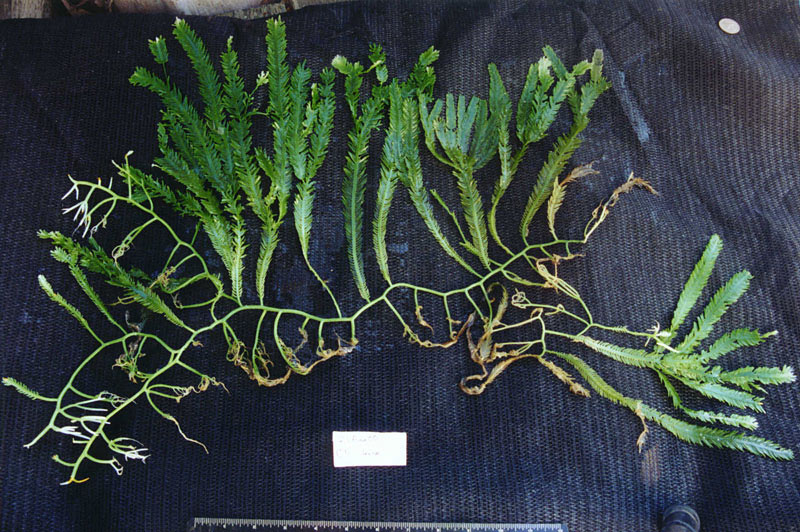

# Écologie et habitats des macroalgues {#ecologie}

> Avant de lire — Idéalement, lisez d’abord « Usages » pour le contexte, puis revenez ici pour comprendre les milieux. Ensuite, poursuivez avec « Herbiers marins », puis « Phylogénie/évolution » et « Classification ».

```{r setup7, include=FALSE}
require(knitr)
opts_chunk$set(echo = FALSE, warning = FALSE, message = FALSE, fig.align = "center", fig.pos = "H")
```
## Introduction

Les macroalgues sont des organismes photosynthétiques pluricellulaires formant des thalles visibles à l’œil nu. Elles colonisent principalement les zones côtières, du supralittoral éclaboussé jusqu’au subtidal profond, lorsque la lumière y pénètre encore. Leur distribution résulte d’un compromis entre contraintes physiques (lumière, hydrodynamisme, température, salinité, substrat) et interactions biotiques (compétition pour l’espace et la lumière, herbivorie, facilitation). Les trois grands groupes taxonomiques — Chlorophyta (algues vertes), Phaeophyceae (algues brunes) et Rhodophyta (algues rouges) — diffèrent par leurs pigments, leurs réserves et nombre de traits écophysiologiques, ce qui conditionne leur niche et leur zonation.

::: {.infobox}
Mots‑clés: niche écologique; zonation; lumière; hydrodynamisme; substrat; herbivorie; résilience; services écosystémiques.
:::

## Facteurs abiotiques déterminants

### Lumière, profondeur et turbidité

La lumière conditionne la distribution verticale. Son atténuation suit généralement la loi de Beer–Lambert:

$$ I(z) = I_0\, e^{-k z} $$

où $I_0$ est l’irradiance incidente en surface, $I(z)$ l’irradiance à la profondeur $z$ et $k$ le coefficient d’extinction (turbidité, matière dissoute et particulaire). Les Phaeophyceae (fucoxanthine) et les Rhodophyta (phycobiliprotéines) exploitent des bandes spectrales différentes, favorisant leur présence respectivement au médiolittoral/subtidal peu profond et plus en profondeur selon la clarté de l’eau. La photoinhibition survient à forte irradiance, particulièrement à l’estran lors des émersions au soleil.

Points clés
- La qualité spectrale change avec la profondeur: le rouge est rapidement absorbé, le bleu‑vert pénètre plus loin.
- L’acclimatation pigmentaire et la plasticité du thalle (épaississement/lamination) optimisent l’absorption.

Profondeur euphotique et point de compensation
- La profondeur de compensation $z_c$ où la production nette est nulle satisfait $I(z_c) = I_c$ (irradiance de compensation), soit:

$$ z_c = \frac{1}{k}\, \ln\!\left(\frac{I_0}{I_c}\right). $$

- Les courbes $P$–$E$ (production vs irradiance) se caractérisent par $\alpha$ (pente initiale), $P_{\max}$ (plateau) et $E_k = P_{\max}/\alpha$ (irradiance de transition).

### Marées, émersion et stress de dessiccation

En estran, les cycles d’émersion/immersion imposent alternance de stress hydrique, thermique et UV. Les espèces du supralittoral tolèrent de longues périodes à l’air libre (mucilages, cuticules, compaction des tissus) et reprennent la photosynthèse rapidement à l’immersion. La durée d’émersion décroît vers l’infralittoral, définissant une zonation verticale nette.

### Hydrodynamisme (houle, courant) et exposition

Le régime de vagues et de courants module l’apport de nutriments et d’oxygène, mais impose des contraintes mécaniques. Les morphologies adaptées incluent thalles flexibles, lamelles découpées et stipes résistants. L’hydrodynamisme peut limiter les espèces fragiles à des zones abritées, tandis qu’il favorise des espèces opportunistes à croissance rapide là où l’apport en nutriments est fort.

### Substrat et fixation

La présence d’un substrat stable et rugueux conditionne la fixation via crampons/hapteres (Figure \@ref(fig:crampons)). Sur sédiments meubles, les macroalgues se développent plutôt sous forme d’amas opportunistes (e.g., Ulva) ou s’ancrent grâce à des structures spécialisées/entrelacements avec des bioconstructions (maërl). Les phases microsporiques requièrent souvent des biofilms propices au recrutement. La flottabilité, assurée par des aérocystes, favorise l’accès à la lumière en subtidal (Figure \@ref(fig:aerocystes)).

```{r aerocystes, echo=F, fig.cap="Aérocystes (pneumatocystes) facilitant la flottabilité et l’accès à la lumière chez des algues brunes.", out.width = "70%"}

```

```{r crampons, echo=F, fig.cap="Crampons (holdfasts) assurant l’ancrage au substrat dur.", out.width = "70%"}
knitr::include_graphics("./images/crampons.png")
```

### Température et salinité

La température affecte la cinétique enzymatique, la croissance et les limites biogéographiques. Les vagues de chaleur marines provoquent des mortalités massives et des déplacements d’aires (retrait d’espèces tempérées, avancée d’espèces chaudes). La salinité conditionne l’osmoregulation: espèces euryhalines (estuaires, lagunes) vs sténohalines (milieu marin stable).

### Nutriments (N, P, oligo‑éléments)

Les nutriments contrôlent la productivité. En zone côtière, des apports terrigènes (eutrophisation) favorisent des blooms d’algues opportunistes (Ulva spp.), pouvant entraîner hypoxie et altération des habitats.

Cinétique d’absorption et quotas internes
- Cinétique de type Monod pour la croissance spécifique $\mu$ en fonction du substrat limitant $S$:

$$ \mu(S) = \mu_{\max}\, \frac{S}{K_s + S}. $$

- Modèle à quota interne (Droop): la croissance dépend du quota cellulaire $Q$ et d’un quota minimal $Q_0$:

$$ \mu(Q) = \mu_{\max}\, \Big(1 - \frac{Q_0}{Q}\Big), \quad Q > Q_0. $$

Ces formulations expliquent l’avantage des espèces opportunistes lors d’élévations rapides de nutriments (fort $\mu_{\max}$, faible $K_s$) et l’importance du stockage transitoire ($Q$ élevé) pour soutenir la croissance quand la colonne d’eau est pauvre.

## Facteurs biotiques et interactions

### Compétition pour l’espace et la lumière

La surface de substrat dur est une ressource limitée. Les macroalgues entrent en compétition via surcroissance, ombrage et libération de composés allélopathiques. Les successions écologiques sur substrats neufs montrent d’abord des espèces pionnières à croissance rapide, puis des espèces plus structurantes (fucoïdes, laminaires).

### Herbivorie et cascades trophiques

Les invertébrés (oursins, gastéropodes) et poissons brouteurs régulent la biomasse algale. Des déséquilibres (surpêche de prédateurs d’oursins) peuvent entraîner des « barrens » dominés par les herbivores, au détriment des forêts de laminaires. Les défenses chimiques (phlorotannins chez les Phaeophyceae) et structurales modulent la palatabilité. Les mésograzers (amphipodes, isopodes) consomment tissus et épiphytes, influençant les interactions plante–microbiote et la transmission d’agents pathogènes.

### Facilitation, épiphytes et biofilms

Certaines macroalgues stabilisent le substrat, réduisent le stress hydrodynamique et facilitent l’installation d’autres espèces. Les biofilms microbiens (Figure \@ref(fig:biofilm-ecologie)) influencent l’adhésion des spores et le recrutement. Les épiphytes augmentent la complexité mais peuvent réduire la photosynthèse de l’hôte; l’équilibre entre facilitation et compétition dépend du contexte (lumière, nutriments, herbivorie).

## Zonation et grands habitats côtiers

### Estran rocheux: supra‑, médio‑ et infralittoral

- Supralittoral (éclaboussures): croûtes cyanobactériennes, littorinidés, algues très tolérantes à la dessiccation.
- Médiolittoral: fucoïdes (Fucus spp.) formant des ceintures; alternance immersion/émersion; forte variabilité thermique et lumineuse.
- Infralittoral supérieur: laminaires et grandes algues rouges; immersion quasi permanente; lumière plus stable.

```{r biofilm-ecologie, echo=F, fig.cap="Biofilm sur substrat dur: matrice microbienne favorisant l’adhésion des spores et le recrutement des juvéniles.", out.width = "70%"}

```

### Forêts de laminaires (kelp forests)

Écosystèmes structurants des zones tempérées, avec canopée, strate intermédiaire et sous‑bois. Haute productivité, rôle d’habitat/nurserie, atténuation hydrodynamique. Sensibles aux vagues de chaleur, à l’explosion d’oursins, et à l’envasement.

### Estuaires et lagunes euryhalines

Salinité variable, turbidité élevée, fortes fluctuations saisonnières. Communautés dominées par espèces euryhalines et opportunistes (Ulva, Cladophora). Sites sensibles aux apports nutritifs et à l’anthropisation.

### Récifs, maërl et substrats biogènes

Les algues rouges calcaires (maërl, Lithothamnion) forment des habitats tridimensionnels fragiles, abritant une biodiversité élevée. Très sensibles au dragage, à l’envasement et à l’acidification.

```{r calcification, echo=F, fig.cap="Calcification chez des algues rouges calcaires: implication pour les récifs de maërl et la résistance mécanique.", out.width = "70%"}
knitr::include_graphics("./images/calcification.JPG")
```

### Substrats meubles et structures anthropiques

Sur sable/vase, les macroalgues fixées sont rares; on observe des amas libres ou des enracinements opportunistes. Les infrastructures (digues, pontons, coques) offrent des substrats durs favorisant le fouling, incluant des espèces non indigènes.

```{r caulerpa, echo=F, fig.cap="Exemple de stratégie d’occupation sur substrat meuble: stolons de Caulerpa facilitant la colonisation horizontale.", out.width = "70%"}

```

### Biogéographie et gradients latitudinaux

La composition des flores macroalgales varie entre provinces biogéographiques (polaires, tempérées froides/chaudes, tropicales) sous l’effet conjoint de la température moyenne, de l’amplitude saisonnière et des courants. Les zones tempérées froides présentent souvent de vastes forêts de laminaires, tandis que les tropiques montrent une dominance d’algues calcaires et de tapis « turf ». Les transitions (écotones) sont sensibles aux changements climatiques: de faibles déplacements d’isothermes suffisent parfois à recomposer les communautés.

### Zonation horizontale et micro‑habitats

À échelle fine, l’orientation du rivage, la microtopographie (creux, surplombs), la rugosité du substrat et l’ombre portée créent des micro‑habitats contrastés qui modulent la distribution des espèces à quelques mètres d’intervalle. Les faces exposées à la houle favorisent des thalles robustes et plaqués; les anses abritées et les cuvettes de marée soutiennent des espèces plus fragiles et une diversité élevée d’algues rouges sciaphiles.

## Adaptations morphologiques et physiologiques

- Ancrage: crampons/hapteres, rhizines; adhésifs biologiques.
- Architecture: thalles lamellaires, fruticuleux, filamenteux; flexibilité et découpe limitant la trainée.
- Flottabilité: aérocystes (pneumatocystes) pour accéder à la lumière en subtidal.
- Protection: cuticules, mucilages, composés phénoliques; réduction des pertes hydriques.
- Pigments et photoprotection: chlorophylles, fucoxanthine, phycobiliprotéines; caroténoïdes protecteurs.
- Osmorégulation: osmolytes (mannitol, proline, glycérol) en milieux variables.

Adhésion et colles naturelles
- Sécrétion d’adhésifs polysaccharidiques et phénoliques par les germlings et les crampons; rôle des métaux (Ca, Mg) et du pH interstitiel dans la prise.
- Dépendance au conditionnement du substrat (biofilm) et aux signaux chimiques pour l’initiation de l’adhésion.

## Dynamiques temporelles: phénologie, succession, résilience

- Phénologie: cycles saisonniers de croissance et reproduction (ex. laminaires maximales au printemps‑été dans les zones tempérées).
- Succession: colonisation par pionnières → espèces structurantes; rôle des perturbations (tempêtes) dans le maintien de mosaïques d’habitats.
- Résilience: capacité de régénération (recrutement, fragments), dépendante des réserves de propagules et de la connectivité.

Rôle des perturbations
- Perturbations aiguës (tempêtes, vagues de chaleur) vs pressions chroniques (eutrophisation, sédimentation) déterminent des trajectoires de succession différentes.
- Connectivité hydrodynamique: dispersion des propagules et recolonisation conditionnent le retour d’états forestiers après phase « barrens ».

## Rôle écologique et services écosystémiques

- Productivité primaire côtière, contribution aux cycles C/N.
- Ingénierie d’écosystème: création d’habitats complexes, stabilisation des sédiments, atténuation des vagues.
- Support de biodiversité: refuges, nurseries pour invertébrés et poissons.
- Services pour la société: ressources (alimentaires, chimiques), support à la pêche, atténuation de l’eutrophisation via assimilation des nutriments.

Enjeux « carbone bleu »
- Export de débris (détritus) vers les fonds, séquestration partielle du carbone.
- Atténuation locale potentielle via culture intégrée multi‑trophique (IMTA) en limitant les nutriments dissous.

## Pressions anthropiques et changements globaux

- Eutrophisation: blooms d’Ulva, hypoxie, altération des habitats benthiques.
- Pollution: métaux, hydrocarbures; effets sublétaux sur croissance et reproduction; bioaccumulation.
- Réchauffement et vagues de chaleur marines: déclin des laminaires tempérées, tropification des flores.
- Acidification: impacts sur algues calcaires (maërl) et sur la compétition interspécifique.
- Espèces non indigènes: vecteurs (navigation, aquaculture); compétition et modification des habitats.
- Désoxygénation: baisse de l’oxygène dissous, épisodes d’hypoxie amplifiant les effets des blooms et modifiant les réseaux trophiques.

## Études de cas

### Kelp forests (Macrocystis, Laminaria)

Forêts hautement productives et structurantes des zones tempérées et froides. Sensibles aux cascades trophiques (prolifération d’oursins) et aux vagues de chaleur. Mesures de conservation: gestion des herbivores, réduction des pressions locales, restauration ciblée.

### Proliférations d’Ulva en zones eutrophisées

Apports azotés/phosphorés élevés → croissance rapide d’Ulva spp. Conséquences: marées vertes, anoxie dans les vasières, nuisances. Réponses: réduire les intrants à la source, valorisation limitée des biomasses collectées.

### Récifs de maërl

Habitat biogène à croissance lente; vulnérable au dragage et à l’envasement. Priorité de protection en raison de son rôle d’abri et de nurserie.

## Points de synthèse et notions à maîtriser

À retenir
- La distribution des macroalgues est pilotée par la lumière et modulée par hydrodynamisme, substrat, température et salinité.
- Les interactions biotiques (compétition, herbivorie, facilitation) façonnent la zonation et la dynamique des communautés.
- Les macroalgues sont des ingénieurs d’écosystèmes offrant des services majeurs mais vulnérables aux pressions anthropiques.

Glossaire
- Zonation: répartition des espèces selon des gradients (vertical, horizontal).
- Euryhalin/Sténohalin: large/étroite tolérance à la salinité.
- Aérocyste: vésicule gazeuse conférant la flottabilité.
- Maërl: dépôt d’algues rouges calcaires formant des récifs biodiverse.

::: {.infobox}
À retenir: Les macroalgues sont d’excellents modèles des réponses écophysiologiques aux gradients physiques et de puissants ingénieurs d’écosystèmes côtiers.
:::
