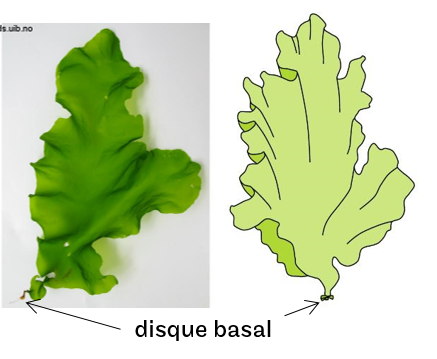

# Chlorophyta {#chlorophyta}

> Avant de lire — Lisez d’abord « Phylogénie/évolution », puis « Morphologie » et « Biochimie ». Ce chapitre prépare « Diversité – Phaeophyceae » et « Diversité – Rhodophyta ».

```{r setup8, include=FALSE}
require(knitr)
opts_chunk$set(echo = FALSE, warning = FALSE, message = FALSE, fig.align = "center", fig.pos = "H")
```

Objectifs du chapitre
- Identifier les principaux groupes de Chlorophyta côtiers et leurs traits diagnostiques.
- Relier ultrastructure, pigments et cycles de vie aux habitats marins.
- Distinguer les espèces proches et les confusions courantes.

## Caractères généraux

- Pigments: chlorophylles a et b (pas de fucoxanthine, pas de phycobiliprotéines)
- Réserves: amidon (stroma plastidial chez lignée verte), parfois polyols
- Organisation: unicellulaire, filamenteuse, siphonale (coenocytique), foliacée
- Paroi: principalement cellulosique; ulvanes chez Ulva

## Groupes majeurs et exemples marins

### Ulvophyceae
- Ulvales: Ulva (lames mono/bistromatiques), Ulva “Enteromorpha” (tubulaire)
- Bryopsidales: Caulerpa (siphonal; stolons et frondes), Codium (coenocyte spongieux)
- Cladophorales: Cladophora (filamenteuse, mésoplastidie)

```{r ulva, echo=F, fig.cap="Disque de fixation chez Ulva (critère pratique d’identification).", out.width = "60%"}

```

```{r caulerpa, echo=F, fig.cap="Stolons et frondes siphonales chez Caulerpa: colonisation des substrats meubles.", out.width = "70%"}
knitr::include_graphics("./images/caulerpa_stolon.jpg")
```

### Trebouxiophyceae et Chlorophyceae (pointe marine)
Principalement dulçaquicoles/terrestres; quelques espèces tolérantes (biofilms littoraux, encroûtements).

## Cycles de vie et reproduction

- Ulva: alternance isomorphe (gamétophyte = sporophyte), reproduction sexuée et asexuée (zoo-/aplanospores)
- Caulerpa/Codium: organisation siphonale; reproduction sexuée souvent cryptique; fragmentation efficace

## Écologie, habitats et bioindication

- Ulva: opportuniste, blooms en zones eutrophisées (marées vertes); tolérance aux variations T/S; bioindication des nutriments
- Caulerpa: colonisation rapide des substrats meubles, parfois invasive (pinnules, stolons)
- Cladophora: biofilms littoraux, préférences pour substrats durs en zones lumineuses

## Points de diagnostic et confusions courantes

- Ulva vs Monostroma: épaisseur (bi-/monostromatique), texture et déchirures
- Codium vs Bryopsis: texture spongieuse (Codium), ramification fine plumeuse (Bryopsis)

::: {.infobox}
À retenir: Chez les Chlorophyta marines, l’architecture (lame, tube, siphon) est un indice clé; Ulva domine les contextes eutrophes tandis que Caulerpa/Codium exploitent les substrats meubles.
:::
